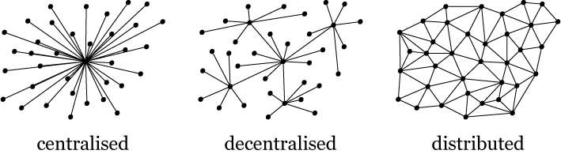
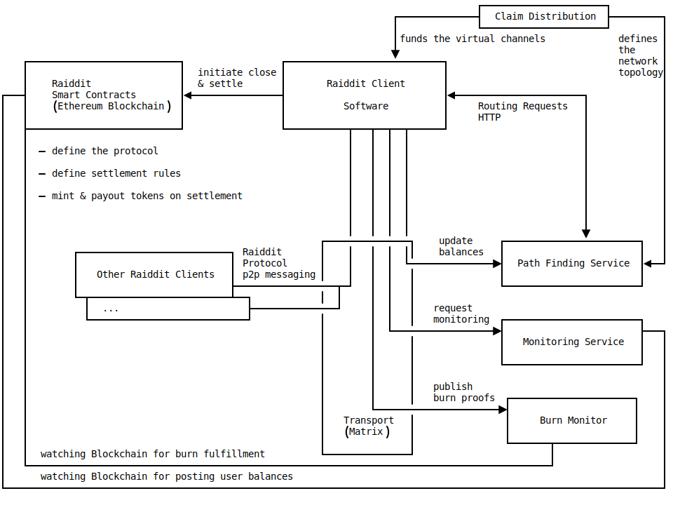

<h1 id="raiddit" style="margin-top: 0;">
  
</h1>

  

    Raiddit is a modified version of Raiden which has been adapted to fulfill Reddit’s use case specific requirements, such as:
  

  <ul>
    <li>Easy and free (gas-less) onboarding that offers better usability than standard Raiden</li>
    <li>An off-chain burning mechanism</li>
    <li>Scalable peer-to-peer token transfers</li>
    <li>Raddit & standard Raiden have been developed under a permissive Open Source license</li>
  </ul>
  

    The focus lies on having as few transactions on the blockchain as possible while maintaining the security and decentralization aspects of the blockchain.
  

  <h1>How it works & scales</h1>

  <h2>How it works</h2>
  

    

      Raiddit is going to be described in the context of a community points lifecycle. This lifecycle starts with the distribution and ends with the exit from the system. The exit can be either a token burn or by the user offboarding the network and claiming the tokens on-chain. 
    

  

  <h3>Onboarding</h3>
  

    

      As of today, Reddit is generating claim proofs (in short “claims”) which Reddit users can use to claim community points on-chain. The step to mint and transfer tokens into a Layer 2 (L2) system can be completely avoided if the L2 system accepts such claims as a deposit itself. Raiddit does just that. A claim is equivalent to a channel deposit in the Raiden Network. This means that any user can start using Raiddit upon receiving the claim.
    

    

      In order to prevent double spending, the claim is bound to a specific partner and only valid for this particular payment channel. It is equivalent to a deposit to a Raiden Network smart contract. Since there are no tokens minted yet, this kind of channel is called a “virtual channel”.
    

  

  <h3>Payments</h3>
  

    

      The Raiden Network is a payment channel system where users are connected to the network by having direct channels with other participants. While direct partners can be paid within the corresponding channel with the other participant in the network, such payments can also be routed through multiple nodes. Furthermore, payments are secured by hash time locks. This makes payments as fast as sending a message online. More information on the mediated payments can be found in <a href="https://raiden.network/101.html">Raiden’s mediated payment protocol</a>.
    

  

  <h3>Subscriptions / Burning</h3>
  

    

      In Raiddit the possibility to burn tokens via Raiden has been added. This off-chain burning mechanism allows a user to pay for subscriptions from within a payment channel. In order to burn tokens, both participants need to sign a burn proof containing the information of community points burnt. Both participants need to sign this proof, since these points/tokens get subtracted from the burning party’s balance. The burn proof is sent to Reddit and can at a later stage be used to enforce burning the tokens on chain.
    

  

  <h3>Offboarding</h3>
  

    

      Offboarding is the process when a user wants to exit Raiddit and receive their current balance on-chain. Until settlement happens no actions are made on-chain. This means that no tokens were minted or burned. The protocol defined in the Raiddit smart contracts, however, makes the off-chain signatures enforceable on-chain. This essentially upgrades the signed proofs of payments/token-burns to on-chain actions. Ideally users do not leave the system, but they are able to do so whenever they want. Claims, payments and burn proofs are accumulated together and the current users’ balances are calculated out of it. There is only one claim to be minted, which contains the total amount to be claimed (each month new claims accumulate on top of the older ones). As an example, if a user decides to exit from the system after a year of usage, there is only one transaction (or rather a settlement process) to be made in order to receive his/hers rightful amount of tokens.
    

  

  <h2>Security</h2>
  

    

      The concept of updating balances by signed messages between the peers is extended to also receive updated claims and burn proofs. This enables scaling token distribution as well as burning. When offboarding, the smart contracts take care of composing all virtual events during the lifecycle of a channel and both participants will submit their latest:
    

    <ul>
      <li>Claims including the total amount received in this channel</li>
      <li>Balance proof signed by their partner</li>
      <li>Burnt amount</li>
    </ul>
    

      The Raiddit smart contract composes the signed messages and calculates the rightful amount of tokens for each participant. The tokens will be minted by the smart contract which is the ERC-777 like operator of the community token contract and distributed to the owners. Due to the postponed minting process, burnt tokens simply do not get minted in the first place.
    

  

  <h3>Verification of messages</h3>
  

    

      New claims, burn proofs and payments must have monotonically increasing values in order to be valid. This technique makes it possible to prevent double spend attacks. If all involved parties act in their best interest, the correct amount of tokens will be distributed. Reddit as the service provider involved in the burn process is considered to be one of the parties.
    

  

  <h4>Claims</h4>
  

    

      Claims must consist of a valid signature of the token issuer. Upon closing, each participant submits their own claim. It is in their own best interest to submit the latest claim since it will result in the highest payout.
    

  

  <h4>Balance Proofs</h4>
  

    

      Each participant submits the latest balance proof of its partner. This is a main concept in standard Raiden. A balance proof contains the transferred amount to the partner. Submitting an old balance proof would result in a lower payout for the participant.
    

  

  <h4>Burnt Amount</h4>
  

    

      Securing the right amount to be burned is a bit more complex. Reddit would be the recipient of a burn action and in return it has to provide a service for it. If two participants want to offboard and start the settlement process, Reddit or a delegated party need to monitor that  the participants are behaving correctly and stating the right burnt amount. If the participants misbehave and do not state the correct amount, Reddit can intervene in the challenge period and submit the signed burn proof by the participants and update the amount to be burnt. A separate monitoring service can also be leveraged to prevent double spends of the burned tokens.
    

  

  <h2>How it scales</h2>
  

    

      The standard Raiden Network offers more scalability by leveraging connected peers to offer more efficient payment routing. There is no single centralized operator in the system, rather each user is an operator. Payments which are not routed over the same channels do not affect each other. How scalable the network is depends on the network’s topology (the graph of connections between users, and their deposited token amounts). If every user is connected to one node and all payments are routed through it, then it is likely that this “hub” becomes the bottleneck in the system. The Raiden protocol makes no limitations on how the topology is built. From fully distributed to a central star topology, everything is possible. This gives the network the flexibility to evolve over time and create topologies based on the requirements of the system at any given time. It might be useful to have a hub like topology upon bootstrapping the network and decentralize over time to avoid bottlenecks. The network topology can evolve based on user activity data to guarantee a healthy and balanced network state.
    

    

      
    

  

  <h1>Cost estimates (on-chain and off-chain)</h1>
  

    

      The off-chain onboarding approach allows the Reddit users to start making payments and burn tokens without needing any on-chain transactions. Upon offboarding, on-chain transactions are required by definition to receive tokens to an Ethereum address. Offboarding can happen for two reasons:
    

    <ol>
      <li>User exits out of the system</li>
      <li>Rebalancing of the network</li>
    </ol>
  

  <h2>User exits out of the system</h2>
  

    

      Assuming that a user only ever exits the system once, this would result in one offboarding process per channel. The cost for offboarding can be found below.
    

  

  <h3>Cost estimation per channel on-chain</h3>
  

    <table>
      <tr>
        <th>transaction</th>
        <th>cost in gas</th>
        <th>executed by</th>
      </tr>
      <tr>
        <td>closeChannel</td>
        <td>
          155964
        </td>
        <td>User A</td>
      </tr>
      <tr>
        <td>updateNonClosingBalanceProof</td>
        <td>
          94638
        </td>
        <td>User B</td>
      </tr>
      <tr>
        <td>settleChannel</td>
        <td>
          203556
        </td>
        <td>Any</td>
      </tr>
      <tr>
        <td>updateBurnAmount</td>
        <td>
          n/a
        </td>
        <td>Reddit</td>
      </tr>
    </table>
    

      Uncooperatively closing a channel involves three transactions with a total gas cost of  155964 + 94638 + 203556 = 454158. Monitoring of the token burning is not yet implemented, so this gas cost could be higher. But as this only has to be called when the participants lie about their burnt tokens, monitoring should be only rarely called and may not increase the average gas costs.
    

    

      Further optimization or the introduction of withdrawals and cooperative closes could yield lower gas costs than listed above.
    

  

  

  <h3>Total gas costs per month</h3>
  

    

      The actual gas cost is highly dependent on the number of users and their behavior. Here is one example of how such a cost calculation could work. Assuming 100k users with 1% of users closing a channel every month, the monthly costs would be
    

    

      100000 * 1% * 454158 gas = 454158000 gas
    

    

      which in turn can be converted to USD, assuming a gas price of 100 gwei/gas and an Ether price of 300 USD/ETH
    

    

      454158000 gas * 100 ETH / 109 gas * 300 USD/ETH = 13625 USD per month
    

  

  <h2>Rebalancing of the network</h2>
  

    

      Another reason for closing channels could be a skewed balance state of the network. In other words, it is possible that no route from a payer to a payee can be found because channel capacity is depleted in one direction. In order to guarantee that payments are possible at any given time, the network may have to be periodically rebalanced by closing the channels and redepositing community points into the system. 
    

    

      If a user has enough balance he/she should always be able to make payments to any other user. Whereas, if there is no route available due to depleted channels along the way, then rebalancing of the network would be needed to boost the channel capacity.
    

  

  <h3>How to avoid rebalancing</h3>
  

    

      The necessity of closing channels is caused by imbalanced channels or offline peers in the network. Measurements to keep the network in a healthy state can be taken which would reduce the number of channels to be closed and rebalanced. Some ideas are
    

    <ul>
      <li>Active users should be well connected peers</li>
      <li>Incentivize peers to provide liquidity</li>
      <li>Rebalance cost-free with every claim distribution on a monthly basis</li>
    </ul>
  

  <h2>Cost estimation off-chain</h2>
  

    

      In the current setup, there will be no off-chain costs. Though for a healthy network, as in the standard Raiden network, helper services incentivized by fees would be needed. These services as well as users providing liquidity could be incentivized to provide their services to the Reddit community. These services could be paid in fees. An estimation of the amount of fees directly depends on the network activity. It is hard to estimate the off-chain fees without modeling the network activity but it can be assumed to be a negligible fraction of the on-chain transactions costs.
    

    

      Furthermore, service providers help the community to sustain a healthy network. The community could incentivize these actors by considering them in the next token distribution. This would deepen the concept of a self-sustaining community where the community points are not only used to incentivize participation in the community, but are also used to incentivize the service providers. Active users in the community would be attracted to take over these service provider tasks instead of participants who are pure service providers.
    

  

  <h1>How to run it</h1>
  

    

      The Raiddit PoC can not directly be integrated into the Reddit page or App. However, any user can run the PoC including all required features in a dedicated scenario using the Raiden Scenario Player. We use the Raiden Scenario Player to run nodes representing 100 active Reddit Users performing all actions with respect to the Reddit token lifecycle - token claiming, minting, transferring, burning and offboarding. 
    

    

      A user has to start a Raiden Service Bundle (<code>raiddit</code> branch) and the Raiden Scenario Player (<code>raiddit</code> branch) to orchestrate everything. 
    

    

      We have dedicated branches in the different Raiden repos for the Raiddit PoC called <code>raiddit</code>. A user must clone and checkout those branches to be able to run the demo scenario. Additionally, a user needs access to the Ethereum blockchain and two preloaded Ethereum keystores to cover on-chain costs.
    

    <ol>
      <li>Get a machine of at least 24 cores and 16 GB RAM (more cores will speed up startup)</li>
      <li>
        Get 2 Ethereum keystore files:
        <ul>
          <li>1 keystore loaded with 0.1 ETH (or 0.1 Gö-ETH) - PFS Account</li>
          <li>1 keystore with 10 ETH for the Scenario Player (or 30 Gö-ETH) - SP Account</li>
        </ul>
      </li>
      <li>Get an Ethereum node or use Infura with ETH-RPC </li>
      <li>Create a new Python >=3.7 virtual environment</li>
      <li>Clone the <a href="https://github.com/raiden-network/raiden-contracts/tree/raiddit" target="_blank">raiden-contracts</a>, <a href="https://github.com/raiden-network/raiden/tree/raiddit" target="_blank">raiden</a> and <a href="https://github.com/raiden-network/scenario-player/tree/raiddit" target="_blank">scenario-player</a> repositories and make sure they are checked out into the raiddit branch.</li>
      <li>
        From inside the activated virtualenv run the following commands:
        

          <pre><code>cd scenario-player 
pip install -e ../raiden-contracts 
pip install -e ../raiden 
make install-dev</code></pre>
        

      </li>
      <li>
        In a separate terminal clone the <a href="https://github.com/raiden-network/raiden-services/tree/raiddit">raiden-services</a> repo (again to the <code>raiddit</code> branch), create a separate Python virtualenv, run <code>make install-dev</code> and start the Raiddit Pathfinding Service with PFS Account:
        

        <pre><code>python -m pathfinding_service.cli \ 
--keystore-file &lt;$PATH-TO-FILE/filename&gt; \ 
--eth-rpc &lt;$YOUR-ETHEREUM-NODE&gt; \ 
--service-fee 0 \ 
--enable-debug</code></pre>
        

      </li>
      <li>
        Back in the scenario-player environment change the scenario environment file <a href="https://github.com/raiden-network/scenario-player/blob/raiddit/scenario_player/environment/raiddit-demo.json" target="_blank">raiddit-demo.json</a>, and change the following values to fit
        <ul>
          <li><code>eth_rpc_endpoint</code> - the URL of your Eth node RPC interface</li>
          <li><code>pfs_with_fee</code> - must point to the url of the PFS you started (default: <code>http://localhost:6000</code>)</li>
          <li><code>pfs_fee</code>: 0</li>
        </ul>
      </li>
      <li>
        Start the Raiddit demo scenario using the Scenario Player with
        

          <pre><code>python -m scenario_player run \ 
examples/raiddit-demo.yaml \ 
--keystore-file &lt;$PATH-TO/filename&gt; \ 
--password &lt;$KEYSTORE-PASSWORD&gt; \ 
--environment &lt;$PATH-TO/raiddit-demo.json&gt;</code></pre>
        

      </li>
    </ol>
  

  <h1>Architecture</h1>
  

    

      Since Raiddit is a modified version of Raiden, it shares Raiden’s general architecture. The main components are,
    

    <ul>
      <li>The Raiddit client software</li>
      <li>The Raiddit smart contracts</li>
      <li>A transport layer to exchange messages</li>
      <li>An auxiliary path finding service</li>
      <li>An auxiliary monitoring service</li>
      <li>The burn monitor</li>
    </ul>
    

      Below is a schematic description of the Raiddit architecture, followed by a detailed description of the main components.
    

    

      
    

  

  <h2>Claim Distribution</h2>
  

    

      Claim Distribution is the publication of signed token claims for all the funded participants in a given subreddit. In the current implementation, it is assumed that there exists a json file with the claims. A claim defines an amount of tokens that one user (i.e. ethereum address) has available in a channel with another user; this is called the channel balance. There can be two claims, one for each side of the channel. The sum of all channel balances defines the network topology.
    

  

  <h2>Raiddit Client</h2>
  

    

      Raiddit Client is a python program, which is run by a user that wants to participate in the network. (Note: a <a href="https://github.com/raiden-network/light-client" target="_blank">javascript light client implementation</a> for standard Raiden is currently in development). Interaction with the Raiddit client software happens through a REST-Api, that allows for comprehensive wallet integration. Raiddit Clients can send transfers and burn tokens by exchanging messages with other Raiddit Clients. A message for a transfer includes a signed balance proof, which states that the channel partner is good to receive a certain amount of the claim(s) that funded the channel.
    

  

  <h2>Raiddit Smart Contracts</h2>
  

    

      The Raiddit Smart Contracts are a set of Ethereum smart contracts which define the rules for a user to exit the system. The Raiddit Token Network contract guarantees that a user will receive their tokens when presenting the partner’s signed balance proof and the funding claim(s). The big difference to standard Raiden is that a channel is not funded through an on-chain token deposit, but instead accepts the signed claims as an equivalent to an on-chain deposit.
    

  

  <h2>Transport Layer</h2>
  

    

      Transport Layer is a federation of Synapse servers that enable clients to message each other via the <a href="https://en.wikipedia.org/wiki/Matrix_(protocol)" target="_blank">Matrix Protocol</a>. Communication with auxiliary services also happens using the transport layer.
    

  

  <h2>Path Finding Service</h2>
  

    

      Path Finding Service is a python program that helps users to route a <a href="https://medium.com/raiden-network/raiden-protocol-explained-489b429fcd90" target="_blank">mediated transfer</a> through the network. This allows a user to send transfers not only to the channel partners, but also to any other online (and connected) participants. Path Finding Service needs to stay updated with the off-chain balances of all the users. Due to this, it can also act as an information service for the current balances.
    

  

  <h2>Monitoring Service</h2>
  

    

      Monitoring Service is an auxiliary service written in python that helps the users to have their latest balance updated with the Token Network contract, in case they are offline and the channel partner initiates the closing of the channel. The users that want their channels to be monitored will request the Monitoring Service to watch their channels by sharing their latest balance proofs.
    

  

  <h2>Burn Monitor</h2>
  

    

      A Burn Monitor is necessary to enforce the proper submission of burn proofs upon closing of a channel. When channel partners sign an off-chain burn proof, the burning only becomes a valid interaction (subscription, …), when published to the Burn Monitor. It only needs to act, if two channel partners want to cheat about their burned token amounts. Off-chain token burns and the burn monitor are a Raiddit-only addition to standard Raiden.
    

    

      The Raiddit protocol enables all regular interactions with the Community Points (token distribution, tipping/transfers, burning) to happen off-chain. Only when users want to take their tokens elsewhere, they have to go on-chain. This allows for a massive reduction in gas costs, because at settlement only the net result of all actions will be attested by the contracts. Thanks to the auxiliary services, the implicit cost of monitoring/data availability can be offloaded to the third parties. Transport and third party services can generally be run by multiple parties, which allows for decentralization.
    

  

  <h1>APIs</h1>
  

    

      The Raiden client provides an API that is organized around REST and has resource-oriented URL endpoints that accept and return JSON-encoded responses.
    

  

  <h2>Sending transfers</h2>
  

    

      To send tokens to other Reddit users, the payments endpoint is used by sending a <code>POST</code> request to <code>/api/v1/payments/&lt;token_address&gt;/&lt;target_address&gt;</code> with a body containing a JSON dictionary with the following keys:
    

    <ul>
      <li><code>amount</code> (required): The amount to be sent.</li>
      <li><code>identifier</code> (optional): The identifier of the payment.</li>
    </ul>
    

      The request will return a status code <code>200</code> if the tokens were sent successfully otherwise a <code>40X</code> code will be returned with a detailed error message.
    

    

      The payment history can be queried using <code>GET</code> requests to the same endpoint.
    

  

  <h4>Example</h4>
  

    

      <pre><code>curl -i -X POST http://localhost:5001/api/v1/payments/0xbfa863Ac58a3E0A82B58a8e958F2752Bfb573388/0xb2646EB8270a4de7451f6F7b259FdE17DBCeedc9 -H 'Content-Type: application/json' --data-raw '{"amount": "42", "identifier": "23"}'</code></pre>
    

  

  <h2>Burning tokens</h2>
  

    

      While token burns are a new concept added for the Reddit challenge, the API to burn tokens is similar to the withdrawal API in Raiden. Tokens are burned by sending a <code>PATCH</code> request to the channel endpoint, <code>/api/v1/channels/&lt;token_address&gt;/&lt;partner_address&gt;</code>, with the desired amount of tokens in the JSON body.
    

    

      It is important to remember that the burn amount is a monotonically increasing number, i.e. if 20 tokens have already been burned in the past and another 10 tokens are to be burnt, one would patch the channels burn amount with a value of 30.
    

  

  <h4>Example</h4>
  

    

      <pre><code>curl -i -X PATCH http://localhost:5001/api/v1/channels/0xbfa863Ac58a3E0A82B58a8e958F2752Bfb573388/0xb2646EB8270a4de7451f6F7b259FdE17DBCeedc9 -H 'Content-Type: application/json' --data-raw '{"total_burn": "30"}'</code></pre>
    

  

  <h2>Closing channels (and settling them)</h2>
  

    

      Channels are closed by patching their state to closed. This initiates the settlement procedure by creating the on-chain channel state. Subsequently the channel partner (or the monitoring service in case the partner is offline) will update their channel state. Once the settlement period is over, the on-chain settlement call will be initiated automatically. This call triggers the calculation of the channel participants’ balances as well as the minting and transfer of those tokens.
    

  

  <h4>Example</h4>
  

    

    <pre><code>curl -i -X PATCH http://localhost:5001/api/v1/channels/0xbfa863Ac58a3E0A82B58a8e958F2752Bfb573388/0xb2646EB8270a4de7451f6F7b259FdE17DBCeedc9 -H 'Content-Type: application/json' --data-raw '{"state": "closed"}'</code></pre>
    

  

  <h1>Known issues or trade-offs</h1>
  

    

      Were the challenges as specified by /u/jarins solved? Probably not? At least not completely:
    

    

      For some requirements of the challenge posted, the Raiden Protocol is not a good fit. It would need time spent on design and architectural changes to be confident that the solution is viable.
    

    

      Raiddit is based on payment channel architecture and has therefore well known trade-offs, just like any other layer 2 solutions. Using payment channels is comparably cheap, fast and mostly decentralized per design due to local consensus. However, being decentralized and having local consensus comes at the cost of not being able to transfer to or via offline nodes. This is because there is no one who the sender can get consensus with. At least not without relying on trusted third parties and undermining the censorship resistance of the protocol. Furthermore, in Raiden the node-state is stored locally to keep users in control of their tokens. Other unsolved issues for this PoC are also in the burning process and the initial topology.
    

  

  <h2>Offline targets - peer to peer token transfers for tips</h2>
  

    

      The Raiden protocol is inherently an interactive on-line protocol, where sender, mediators and target are expected to be available to exchange messages, forward secrets, etc., in order to guarantee safe transfers. In Reddit’s case, expecting a receiving user to be online when sending a payment is a difficult requirement. Users are spread between time zones, have different online patterns, and can disappear for long stretches of time. This is way less problematic in “traditional” payment scenarios, where the receiver of a payment is offering something to be paid for, because the incentives for being online are aligned. But for tipping a user there is no such incentive. That is not to say this is a dead-end, a viable solution could simply not be developed in the last month.
    

  

  <h2>Non-local storage of node state</h2>
  

    

      Following a decentralized design also means that parties are responsible for their end of the state. But that is obviously not always the most convenient and user-friendly approach. In theory it is possible to store the local state anywhere and encrypt it to keep it private. However, last month’s focus has been on other challenges rather than solving this particular requirement. 
    

  

  <h2>Burn monitoring</h2>
  

    

      A solution was developed where the gas costs for minting and burning are reduced to a consolidated on-chain interaction at the end of a channel’s lifetime. As long as users keep their channels open, there is zero gas spent. In Raiddit token burn actions can happen off-chain with zero gas cost. Here the design of local consensus is followed and burning happens as a mutual agreement between the channel partners and Reddit. The obvious trade-off is that burned tokens are not visible to everyone as they would be on a blockchain. The signed burn commitment is being submitted directly to a burn monitor which reacts if the burned amount is not correctly submitted at channel closing. In this design there needs to be a third party, e.g. Reddit, or another incentivized operator, to run such a monitor and prevent cheating by colluding channel partners.  
    

  

  <h2>Decentralization / topology</h2>
  

    

      The Raiddit PoC is designed as a centralized hub-topology. In theory, if there is more data about online status of users available, the topology can be arbitrary. A centralized hub topology solves two major problems, liquidity and not being able to mediate via offline nodes. 
    

    <ul>
      <li>
        

          Liquidity becomes a problem in a payment channel system if a user with sufficient tokens triggers a payment but it does not succeed because a mediator does not have the necessary balance. 
        

        

          <strong>Alice</strong> 10 &lt;─────&gt; 0 <strong>Bob</strong> 5 &lt;─────&gt; 0 <strong>Charly</strong>
        

        

          In this example Alice cannot pay Charly 10 tokens even though she has 10 tokens, because Bob only has 5. A centralized hub can be initially funded with lots of tokens to mitigate this problem. If every user is connected to a sufficiently funded hub - serving as a liquidity provider - any payment up to the users own balance is possible. Sufficiently funded means that the hub must be funded with the total sum of all tokens of all non-hub users. Only in this way, in theory, all users can tip all their tokens to one single user. Suppose there are 100.000 users getting 10 tokens each, then
        

        

          <strong>Alice</strong> 10 &lt;─────&gt; 10*105 <strong>Hub</strong> 10*105 &lt;─────&gt; 10 <strong>Charly</strong>
        

        

          That leads to an initial funding of the hub of 10*1010 tokens. One could argue that this amount only exists for bookkeeping reasons, but a potential collusion of the hub operator and a user can be attractive if those tokens have real world value. 
        

      </li>
      <li>
        

          Having a centralized hub as the only mediator in the network mitigates the problem of not being able to mediate via an offline node. It can be assumed that the hub always will be online and responsive if operated by Reddit or a trusted user. However, this solution can not be the end of the road.
        

      </li>
    </ul>
    

      In order to avoid the dependency on central hubs and embrace the full scaling potential, the network must create channels between the users themselves. Engaged actors in the community can take the role of well connected partners. Based on user data, new claim distributions should aim to let the network decentralize organically. This also means that users which have a decrease in activity will become less relevant for the network stability. In time,  the right balance of well connected peers and decentralisation will hopefully be found. All this is possible because the protocol allows the building of whatever topology is necessary for a given use case. It should be mentioned that different sub reddits could evolve different network topologies over time. 
    

  

