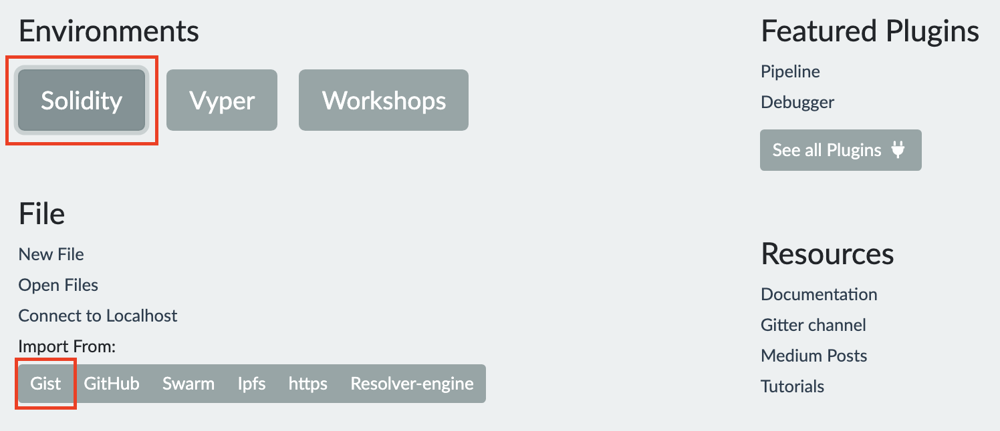
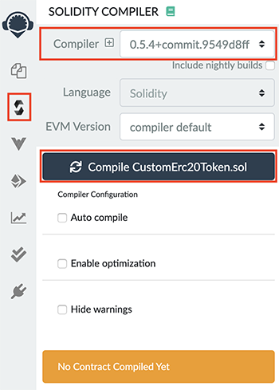
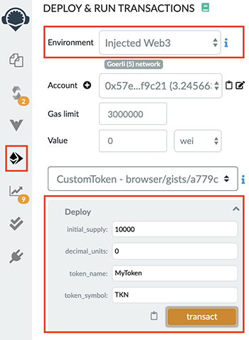
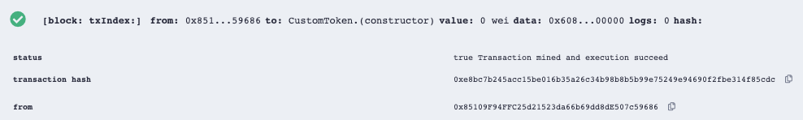

Use Custom Token
################

Introduction
============

In this guide, we will walk through the process of creating a custom token. 
A custom token can be used for any use-case but we will be adding and using it with the Raiden Network.
In order to deploy the Custom Token, you will need to:

- :ref:`Get Goerli Testnet ETH (GÖETH) <custom_token_get_eth>`
- :ref:`Import Custom Token <custom_token_import>`
- :ref:`Compile Imported Token Code <custom_token_compile>`
- :ref:`Deploy Custom Token <custom_token_deploy>`

.. _custom_token_get_eth:

Get Goerli Testnet ETH (GÖETH)
==============================

Goerli is the name of the testnet on Ethereum where we will be deploying our token. 
To pay for the on-chain transactions you'll first need to get some Goerli ETH (GÖETH) on your Ethereum account.

Since we will be using the Goerli testnet you'll have to switch from **"Main Ethereum Network"** to **"Goerli Test Network"** in your MetaMask by selecting it from the top right dropdown.

After switching to the Goerli testnet you can go ahead and acquire some Goerli testnet ETH by following these steps:

1. Copy your address. It is located on the left hand side in MetaMask and starts with "0x".
2. Visit the `Goerli faucet <https://goerli-faucet.slock.it/>`_, there you'll have to paste the address into the input field and check the *"I'm not a robot"*  checkbox.
3. Click on **"REQUEST 0.05 GÖETH"**.

You will see a success message when the request has gone through. If it fails, keep trying until it succeeds.

You can verify that 0.05 GÖETH was actually received by opening MetaMask and see if your Goerli Test Network shows a balance of total 0.05 GÖETH.

.. _custom_token_import:

Import Custom Token
===================

The Raiden Network supports transactions of ERC20 compliant tokens. Any smart contract that implements the ERC20 interface can be used with Raiden.

Importing the custom token Solidity code is done via the `Remix Ethereum IDE <https://remix.ethereum.org/>`_ (Ethereum's integrated development environment). 
You can read more about ERC20 tokens in `this GitHub repo <https://github.com/OpenZeppelin/openzeppelin-contracts/tree/master/contracts/token/ERC20>`_.

1. Start off by getting the Solidity code for an ERC20 token from `this GitHub gist <https://gist.github.com/eorituz/a779c0277f2fc5c935e2b2f62e49da49>`_.
2. Enter the URL for the `Remix Ethereum IDE <https://remix.ethereum.org/>`_ in your browser.
3. Under **"Environments"** click **"Solidity"**.
4. Under **"File"** choose to import from **"Gist"**.
5. In the pop-up that appears enter the ID, *a779c0277f2fc5c935e2b2f62e49da49*, of the gist you just viewed.

If the import was successful you should be able to open the imported code from the file explorer on the left hand side menu.

.. _custom_token_compile:

Compile Imported Token Code
===========================

Before a token can be deployed the imported token code has to be compiled into Ethereum Virtual Machine Code.

Click on the icon underneath the **"FILE EXPLORER"** in the left hand side menu to view the **"SOLIDITY COMPILER"**.

In the compiler you need to:

1. Select **"0.5.4+commit..."** from the "Compiler" dropdown.
2. Click on **"Compile CustomErc20Token.sol"**.

This will compile the token code and once the compiling step is done you’re ready to deploy your custom token.

.. _custom_token_deploy:

Deploy Custom Token
===================

In this step, we will be setting all parameters and finally deploy the custom token to the Goerli testnet.

Navigate to **"DEPLOY & RUN TRANSACTIONS"** in the left hand side menu.

1. Select **"Injected Web3"** from the "Environment" dropdown. This will open up MetaMask.
2. Connect with MetaMask when prompted.
3. Click on the arrow next to the orange **"Deploy"** button to expand the configure parameters.
4. Use the following parameter values:

   -  **initial_supply** **= 10000**
   -  **decimal_units = 0**
   -  **token_name = MyToken**
   -  **token_symbol = TKN**

5. Click the orange **"transact"** button.
6. Confirm the transaction from MetaMask when prompted.

In the Remix Ethereum IDE terminal you should now see an output similar to the picture below. 
Congratulations, you have now successfully deployed a token to Ethereum!

You can click the link in the terminal output that starts with "https://goerli.etherscan.io..." to open a new tab with all the details of the transaction you just sent.

All you need to do to start using your token is to :doc:`download and install Raiden <../overview_and_guide>` and register your token in Raiden, either in the :ref:`Web Interface <webui_register_token>` or by using the :ref:`API <api_tut_register_token>`.
