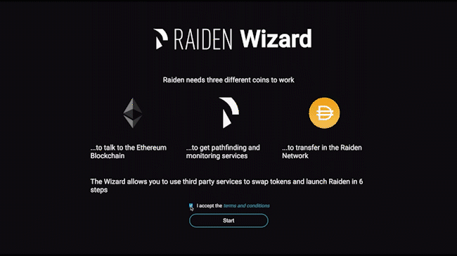

Download and run the Raiden Wizard
##################################

Download the Raiden Wizard
==========================

`Download <https://github.com/raiden-network/raiden-wizard/releases/latest>`__
the Raiden Wizard for:

-  MacOS
-  Linux

Run the Raiden Wizard
=====================

.. warning::

   You need an internet connection to run the Raiden Wizard. The Wizard will launch in your default browser.

   The setup process can take up to five minutes, make sure not to close the browser.

1. Extract and click the ``raiden_wizard`` program to run the installer.
2. Your web browser should open a new window with the Raiden Wizard. If
   not, you can manually type
   `http://localhost:1994 <http://localhost:1994>`__ to access the
   Wizard.

The installation steps of the Raiden Wizard will let you:

-  Create a new Ethereum Account (the "Raiden Account") specifically for
   using with the Wizard.
-  Fund this new Raiden Account with ETH, either from your MetaMask 
   account or by buying ETH via fiat money.
-  Acquire ``RDN`` tokens for using the pathfinding and monitoring
   services.
-  Acquire ``DAI`` tokens for making payments in the Raiden Network.

When you have finished the steps of the Wizard, you can ``LAUNCH``
Raiden and start interacting with the :ref:`Raiden
Webinterface <webui>`.
