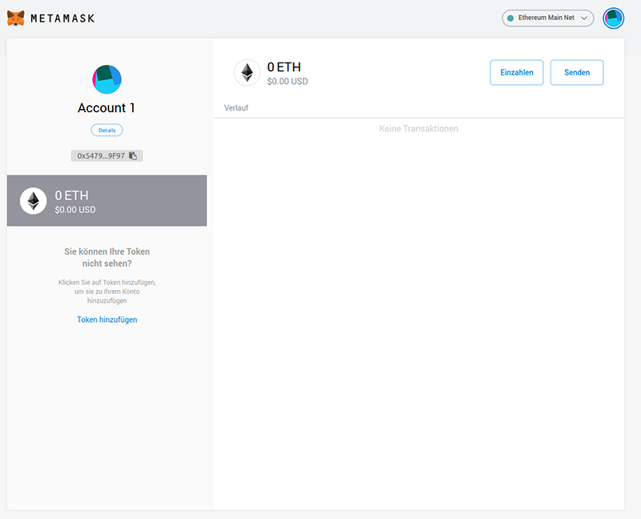

Get MetaMask (optional)
#######################

Instead of using MetaMask you can buy ETH directly in the Raiden Wizard 
via fiat money.

Install MetaMask
================

MetaMask is an in-browser Ethereum wallet. It allows us to send and sign
transactions on the Ethereum blockchain.

To install MetaMask:

1. Visit the `MetaMask website <https://metamask.io>`__.
2. Follow the instructions to add MetaMask as a browser extension.
3. Restart your browser. You should now see the MetaMask icon in the top
   right corner of your browser.

Create an Ethereum account
==========================

With the newly installed MetaMask extension click the icon in your
browser. This will open up MetaMask with a setup guide for creating a
new account (wallet).

After following the instructions you should see a screen with
information about your newly created Ethereum account.

