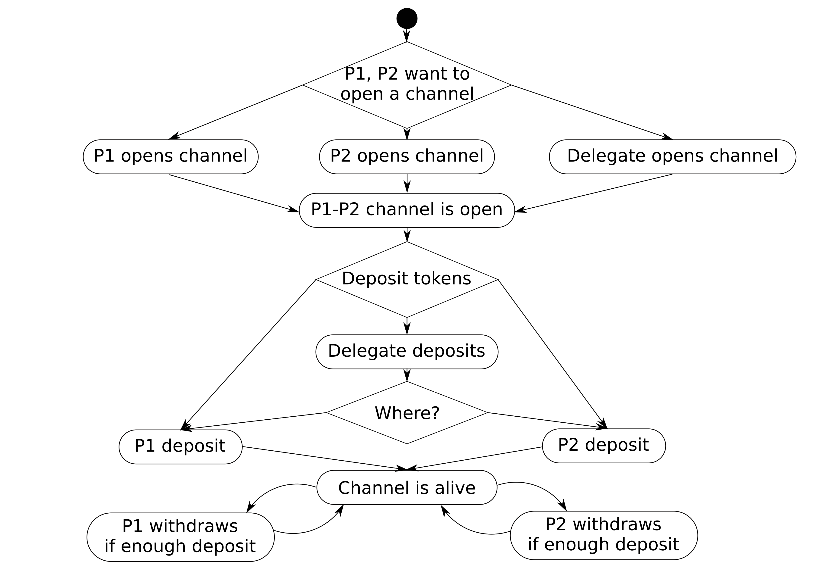
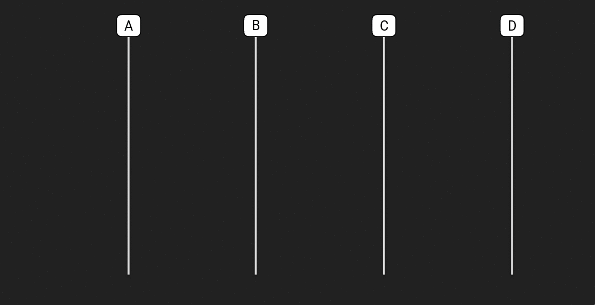
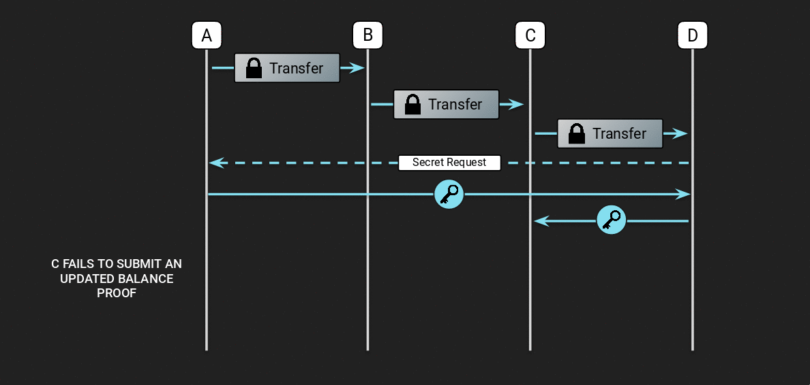
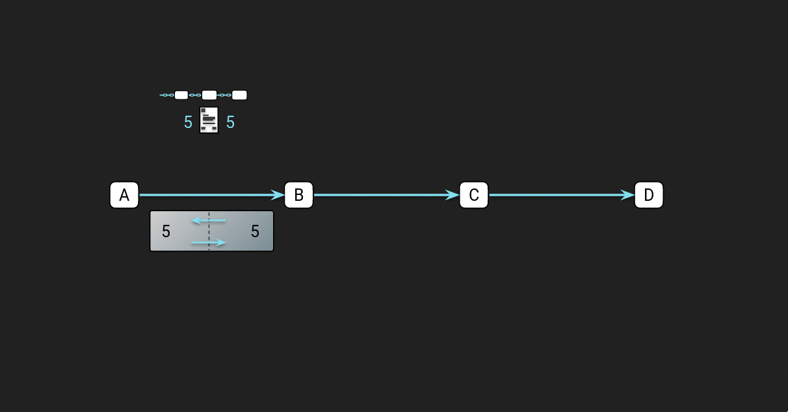
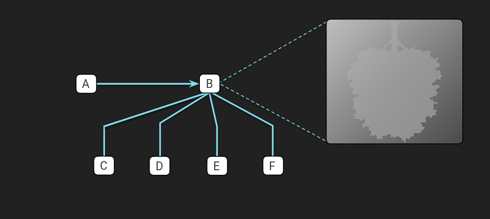
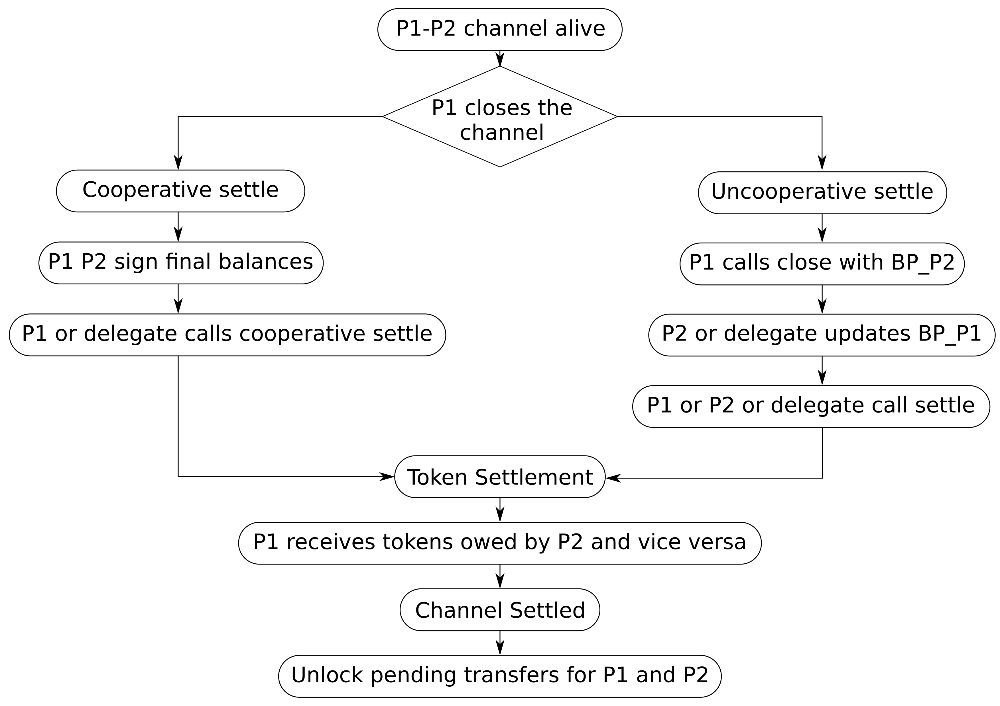
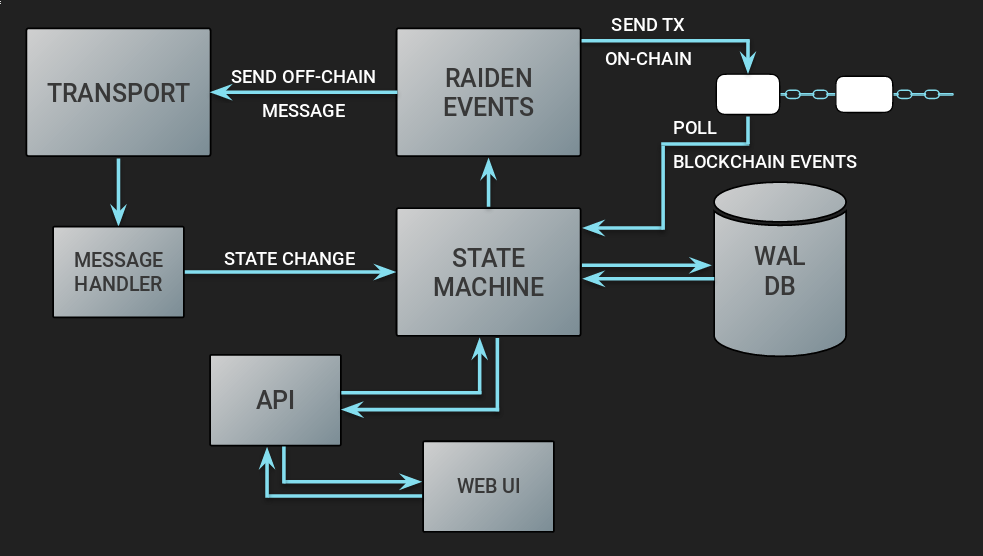

Raiden Developer Onboarding Guide
#################################
.. toctree::
  :maxdepth: 2

Introduction
============
This is a general onboarding guide whose main purpose is to help people who want to develop Raiden. It provides an in-depth explanation of the protocol followed by an explanation of the architecture.

The Raiden Protocol
===================

In this section we will have the general explanation of how the Raiden protocol works, starting from the smart contracts and ending with the offchain messages that are exchanged between Raiden nodes.
For a more formal definition of the protocol please refer to the `specification <https://raiden-network-specification.readthedocs.io/en/latest/>`_.

Smart contracts
***************

Raiden has 4 smart contracts that are needed to support the protocol. They can all be found at the `smart contracts repository <https://github.com/raiden-network/raiden-contracts>`_. The repository also contains scripts to deploy and verify the contracts on different networks.

Token Network Registry
~~~~~~~~~~~~~~~~~~~~~~

The `Token Network Registry <https://github.com/raiden-network/raiden-contracts/blob/04fe5a6c33b2a34cd893c5e546b8df949e194947/raiden_contracts/contracts/TokenNetworkRegistry.sol>`_ contract is the main component that defines a deployment of the Raiden Network.

It is a registry of all different TokenNetwork contracts, one for each token. When someone wants to register a Token and create a network for it they interact with the TokenNetworkRegistry's `createERC20TokenNetwork() <https://github.com/raiden-network/raiden-contracts/blob/04fe5a6c33b2a34cd893c5e546b8df949e194947/raiden_contracts/contracts/TokenNetworkRegistry.sol#L59>`_ function.

Token Network
~~~~~~~~~~~~~

Once a token has been registered with the registry a new `Token Network <https://github.com/raiden-network/raiden-contracts/blob/04fe5a6c33b2a34cd893c5e546b8df949e194947/raiden_contracts/contracts/TokenNetwork.sol>`_ is created for that Token. This is the main contract with which to interact for all onchain channel operations for that token.

Secret Registry
~~~~~~~~~~~~~~~

The `Secret Registry <https://github.com/raiden-network/raiden-contracts/blob/04fe5a6c33b2a34cd893c5e546b8df949e194947/raiden_contracts/contracts/SecretRegistry.sol>`_ is a contract that is deployed along with the ``TokenNetworkRegistry`` and together they define a deployment of the protocol.

It is used when a user needs to `register <https://github.com/raiden-network/raiden-contracts/blob/04fe5a6c33b2a34cd893c5e546b8df949e194947/raiden_contracts/contracts/SecretRegistry.sol#L20>`_ a secret onchain to prove that they knew the secret for a pending transfer before the block of the lock expiration has come.

Endpoint Registry
~~~~~~~~~~~~~~~~~

The `Endpoint Registry <https://github.com/raiden-network/raiden-contracts/blob/04fe5a6c33b2a34cd893c5e546b8df949e194947/raiden_contracts/contracts/EndpointRegistry.sol>`_ contract is a contract used only by the now deprecated `UDP transport <https://github.com/raiden-network/raiden/tree/3ae9ecccdf5d48fd5a9a07fae4752d4971cf6868/raiden/network/transport/udp>`_.

It serves as a mapping between user's ethereum addresses and ip addresses so that the transport layer knows where to send messages to.

Channel Opening Lifecycle
*************************

    The channel opening lifecycle

A channel between two participants can be `opened <https://github.com/raiden-network/raiden-contracts/blob/04fe5a6c33b2a34cd893c5e546b8df949e194947/raiden_contracts/contracts/TokenNetwork.sol#L253>`_ by anyone. But there can be only one channel open between two participants at any time.

Once the channel is open then, anyone can `deposit <https://github.com/raiden-network/raiden-contracts/blob/04fe5a6c33b2a34cd893c5e546b8df949e194947/raiden_contracts/contracts/TokenNetwork.sol#L307>`_ an amount of tokens for either of the two participants. Depositing is done via idempotent calls. That's why the function is called ``setTotalDeposit``, so that if it's called multiple times the result is always going to be the same. The function does not deposit a new amount each time but instead alters the amount of the total deposit that should be in the contract for a participant.

At this point the channel is active and payments can be made.

.. note::
   The withdraw functionality of the contract is currently disabled

At any point and if both participants agree they can also `withdraw <https://github.com/raiden-network/raiden-contracts/blob/04fe5a6c33b2a34cd893c5e546b8df949e194947/raiden_contracts/contracts/TokenNetwork.sol#L375>`_ tokens from the contract via an onchain transaction.

Messages Exchanged during a Raiden Transfer
*******************************************

.. _happy-case-transfer-messages:

The Happy Case
~~~~~~~~~~~~~~

    Happy case of a Raiden Transfer

Let's first look at the messages exchanged in the happy path of a Raiden Transfer. Each Transfer has an ``Initiator``, a ``Target`` and zero or more ``Mediators``. The ``Initiator`` creates a `Locked Transfer <https://github.com/raiden-network/raiden/blob/38971b372dafb3205cbd3df8cfc3306922a55eac/raiden/messages.py#L1124>`_ message and propagates it to the ``Target`` through multiple Mediators.

Once the ``LockedTransfer`` reaches the ``Target`` then they requests the secret from the ``Initiator`` by sending a `Secret Request <https://github.com/raiden-network/raiden/blob/38971b372dafb3205cbd3df8cfc3306922a55eac/raiden/messages.py#L468>`_ message.

When the ``Initiator`` gets the secret request message, they check to make sure that it's a valid one and that it corresponds to a locked transfer that they sent out. If all checks out they send a `Reveal Secret <https://github.com/raiden-network/raiden/blob/38971b372dafb3205cbd3df8cfc3306922a55eac/raiden/messages.py#L710>`_ message back to the ``Target``.

The ``Target`` will process the secret message, register it into their state and then proceed to reveal the secret backwards by sending their own ``RevealSecret`` message to their counterparty.

The counterparty which can either be a ``Mediator`` or the ``Initiator`` will receive this ``RevealSecret`` message and process it. This message tells them that the payee (either the target or another mediator if we got multiple hops) knows the secret and wants to claim the lock off-chain. So then they may unlock the lock and send an up-to date balance proof to the payee. This is done by sending what we (unfortunately) call the `Secret <https://github.com/raiden-network/raiden/blob/38971b372dafb3205cbd3df8cfc3306922a55eac/raiden/messages.py#L557>`_ message back to the partner who sent the ``Reveal Secret``.

This concludes the transfer for that hop. If the receiver of ``RevealSecret`` was the ``Initiator`` then the transfer is finished end-to-end. If it was just a ``Mediator`` then they will have to propagate the transfer backwards by sending a ``RevealSecret`` message backwards to their partner repeating the procedure outlined above.

An Unhappy Case
~~~~~~~~~~~~~~~

    Unhappy case of a Raiden Transfer

Looking at a similar network topology as shown in the happy case above, let's see how the protocol behaves when something goes wrong and our partner does not follow the protocol.

As seen in the figure above once the payee sends the ``Reveal Secret`` message the payer does not respond with the expected balance proof message. If that happens the payee has two choices:

1. If the amount involved in the token is really small then the payee can just do nothing and forfeit it.
2. If the amount is worth an on-chain transaction then the payee can go on-chain by registering the secret on the ``SecretRegistry`` contract and prove he knew the secret before the block of the lock expiration. From that point on the protocol can continue as before but now the secret is visible onchain so everyone along the path now knows it.

Offchain messages at Lock Expiration
~~~~~~~~~~~~~~~~~~~~~~~~~~~~~~~~~~~~

If for some reason the protocol does not proceed and the Target never requests for the secret then the pending transfer lock will at some point expire. At the point of expiration in a payer-payee channel the payer will have to notify the payee that the lock has expired by sending a `LockExpired <https://github.com/raiden-network/raiden/blob/38971b372dafb3205cbd3df8cfc3306922a55eac/raiden/messages.py#L1452>`_ message.

The payee receives the ``LockExpired`` message, removes the lock from its pending locks for the partner and updates the state with tne new balance proof.

Routing
*******

    Routing a Transfer

At the moment routing in Raiden works in a very simple manner. Each node has a global view of the network knowing the initial capacity of each channel by watching for the deposit events happening on chain. As a result each node keeps a graph of the network but that graph may be outdated due to the capacity changing because of offchain transfers.

Each node tries to forward the transfer through the shortest path with enough capacity to the target. If at some poin the transfer can't go through due to the actual capacity not being sufficient or due to the node being offline then a special kind of LockedTransfer called a `Refund Transfer <https://github.com/raiden-network/raiden/blob/38971b372dafb3205cbd3df8cfc3306922a55eac/raiden/messages.py#L1344>`_ will be sent back to the payer, effectively refunding him the transferred amount and allowing him to try another route. This is repeated until either a route is found or we have no other ways to reach the target at which case the Transfer fails.

If the transfer reaches the target and the protocol is followed properly as we saw in the :ref:`happy transfer case <happy-case-transfer-messages>` above then all the pending transfers in the path will be unlocked and the node balances will be updated.

.. _pending-transfers-mediator:

Pending Transfers
******************

    Pending transfers from the perspective of a mediator

When a node mediates transfers all of the locks are kept on the state of the mediator node inside a merkle tree. For each new transfer the lock is appended to the merkle tree.

If the protocol is followed as shown in the :ref:`happy transfer case <happy-case-transfer-messages>` above then the corresponding lock is unlocked and removed from the merkle tree.

.. _close_settlement_lifecycle:

Close/Settlement Lifecycle
**************************

    Channel close/settle lifecycle

At some point in a channel's life either of the participants will want to close the channel. This can happen in one of two ways.

1. If both participants agree on the final state of the channel offchain then they can utilitize the `cooperative settle <https://github.com/raiden-network/raiden-contracts/blob/04fe5a6c33b2a34cd893c5e546b8df949e194947/raiden_contracts/contracts/TokenNetwork.sol#L860>`_ method to close the channel with only 1 onchain transaction.

2. If on the other hand the nodes don't agree offchain (a common adversarial scenario) then one participant needs to first `close <https://github.com/raiden-network/raiden-contracts/blob/04fe5a6c33b2a34cd893c5e546b8df949e194947/raiden_contracts/contracts/TokenNetwork.sol#L470>`_ the channel with the state of received transfers from their partner. Then the partner will have to `update <https://github.com/raiden-network/raiden-contracts/blob/04fe5a6c33b2a34cd893c5e546b8df949e194947/raiden_contracts/contracts/TokenNetwork.sol#L536>`_ the contract with their side of received transfers.

All of the above can also be sent to the chain by a third party.

Once either a cooperative or a normal close is done and the settlement period has passed then anyone can invoke the `settle <https://github.com/raiden-network/raiden-contracts/blob/04fe5a6c33b2a34cd893c5e546b8df949e194947/raiden_contracts/contracts/TokenNetwork.sol#L623>`_ function in the contract to payout the tokens owed to either participant from the finalized transfers.

Finally once the channel is settled, each participant that may have pending offchain transfers that were not finalized can at this point try to `unlock <https://github.com/raiden-network/raiden-contracts/blob/04fe5a6c33b2a34cd893c5e546b8df949e194947/raiden_contracts/contracts/TokenNetwork.sol#L762>`_ them onchain.

Unlocking Pending Transfers
***************************

At this section we are going to look in more detail how the unlocking of pending transfers mentioned in the previous section works.

.. figure:: images/settle_pending_locks.gif
    :width: 600px

    Unlocking pending transfers onchain after settlement

Continuing from the example seen in the :ref:`pending transfers <pending-transfers-mediator>` section above let's explore what happens when ``B``'s partner closes the channel while there are transfers pending.

In the figure above the following things happen:

1. For the payment A->B->C , ``C`` follows the protocol and send the secret back to ``B``.
2. At the same time ``A`` closes the channel and so the normal offchain protocol can not be followed. Instead we enter the channel :ref:`close/settlement <close_settlement_lifecycle>` lifecycle we saw in the previous section with ``A`` closing the channel with what he received from his partner ``B``.
3. Now ``B`` has to register the secret received by ``C`` onchain as he can no longer do it offchain. He has to prove that he knew the secret at a block height before the pending transfer's expiration. He does that by calling `registerSecret <https://github.com/raiden-network/raiden-contracts/blob/04fe5a6c33b2a34cd893c5e546b8df949e194947/raiden_contracts/contracts/SecretRegistry.sol#L20>`_ on the ``SecretRegistry`` contract.
3. Now it's ``B``'s turn to update the contract with what he has received from ``A``. He will provide a hash of the merkle root, the transferred amount and the locked amount to the contract via the `updateNonclosingbalanceproof <https://github.com/raiden-network/raiden-contracts/blob/04fe5a6c33b2a34cd893c5e546b8df949e194947/raiden_contracts/contracts/TokenNetwork.sol#L536>`_ call.
4. After both are done and the settlement period has passed then anyone can settle the channel and send the tokens amounts owed to ``A`` and ``B`` respectively back to its owners.
5. After settlement whoever has pending transfers that need to be unlocked on chain has to unlock them onchain. In this example ``B`` will provide the merkle tree to the contract via the `unlock <https://github.com/raiden-network/raiden-contracts/blob/04fe5a6c33b2a34cd893c5e546b8df949e194947/raiden_contracts/contracts/TokenNetwork.sol#L762>`_ function. That will result in the contract checking each one of the locks and send the locked tokens for which the secret was registered on time to the intended receiver (``B``) and those for which it wasn't back to the payer (``A``).

Raiden Architecture
===================

In this section we are going to see an explanation of how the code of the Raiden client is structured and how it implements the protocol detailed in the previous section and.

Architecture Overview
*********************

    Raiden Architecture Overview

At the core of the Raiden architecture lies a state machine. The state machine gets fed state changes from various sources such as:

- User commands directly from the user through the REST API
- Trigerred via blockchain via polling for blockchain events
- Triggered by receiving an offchain message

All these state changes are processed along with the current state and produce a new state along with something that we call the "Raiden Internal Events" which is essentially I/O since the state machine can't do I/O on its own.

Processing those raiden internal events performs all kinds of I/O such as:

- Sending offchain messages
- Sending onchain transactions
- Logging a debug message

The State Machine
*****************
