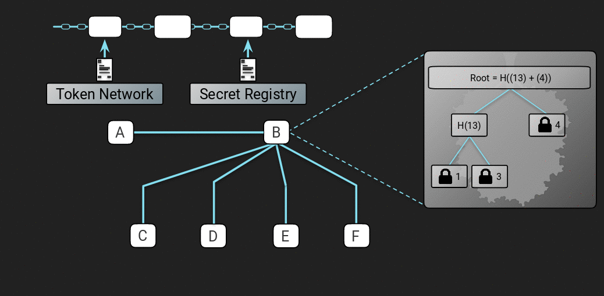

Raiden Developer Onboarding Guide
#################################
.. toctree::
  :maxdepth: 2

Introduction
============
This is a general onboarding guide whose main purpose is to help people who want to develop Raiden. It provides an  explanation of the protocol followed by an explanation of the architecture.

For information on coding style, commit rules and other development rules please refer to the `Contributing Guide <https://github.com/raiden-network/raiden/blob/master/CONTRIBUTING.md>`_.

The Raiden Protocol
===================

In this section we will have the general explanation of how the Raiden protocol works, starting from the smart contracts and ending with the offchain messages that are exchanged between Raiden nodes. For a quick overview, please watch the `video "Raiden Network Protocol Explained" <https://www.youtube.com/watch?v=jlcYmQHHutU>`_.
For a more formal definition of the protocol please refer to the `specification <https://raiden-network-specification.readthedocs.io/en/latest/>`_.

Smart contracts
***************

Raiden has 4 smart contracts that are needed to support the protocol. They can all be found at the `smart contracts repository <https://github.com/raiden-network/raiden-contracts>`_. The repository also contains scripts to deploy and verify the contracts on different networks. For more information on the contracts and the channel lifecycle check the `smart contract specification <https://raiden-network-specification.readthedocs.io/en/latest/smart_contracts.html>`_.

.. _offchain-messages:

Messages Exchanged during a Raiden Transfer
*******************************************

.. _happy-case-transfer-messages:

The Happy Case
~~~~~~~~~~~~~~

.. figure:: images/transfer_happy_case.gif
    :width: 600px

    Happy case of a Raiden Transfer

Let's first look at the messages exchanged in the happy path of a Raiden Transfer. Each Transfer has an ``Initiator``, a ``Target`` and zero or more ``Mediators``. The ``Initiator`` creates a `Locked Transfer <https://github.com/raiden-network/raiden/blob/38971b372dafb3205cbd3df8cfc3306922a55eac/raiden/messages.py#L1124>`_ message and propagates it to the ``Target`` through multiple Mediators. A ``LockedTransfer`` message reserves the amount for the pending payment in each channel between ``Initiator``/``Mediator`` and ``Mediator``/``Target``.

Once the ``LockedTransfer`` reaches the ``Target`` then they request the secret from the ``Initiator`` by sending a `Secret Request <https://github.com/raiden-network/raiden/blob/38971b372dafb3205cbd3df8cfc3306922a55eac/raiden/messages.py#L468>`_ message.  When the ``Initiator`` receives the ``SecretRequest`` message, the ``Initiator`` can safely assume that a mediated locked transfer with the required amount has arrived to the ``Target``, since ``Target`` as a payment receiver has all the incentives to be honest.

When the ``Initiator`` gets the secret request message, they check to make sure that it's a valid one and that it corresponds to a locked transfer that they sent out. If all checks out they send a `Reveal Secret <https://github.com/raiden-network/raiden/blob/38971b372dafb3205cbd3df8cfc3306922a55eac/raiden/messages.py#L710>`_ message back to the ``Target``.  The ``RevealSecret`` message contains a secret that allows each ``Mediator`` or the ``Target`` along the path to claim the locked amount in the pending transfer.

The ``Target`` will process the secret message, register it into their state and then proceed to reveal the secret backwards by sending their own ``RevealSecret`` message to their counterparty.

The counterparty which can either be a ``Mediator`` or the ``Initiator`` will receive this ``RevealSecret`` message and process it. This message tells them that the payee (either the target or another mediator if we got multiple hops) knows the secret and wants to claim the lock off-chain. So then they may unlock the lock and send an up-to date balance proof to the payee. This is done by sending what we (unfortunately) call the `Secret <https://github.com/raiden-network/raiden/blob/38971b372dafb3205cbd3df8cfc3306922a55eac/raiden/messages.py#L557>`_ message back to the partner who sent the ``Reveal Secret``.

This concludes the transfer for that hop. If the receiver of ``RevealSecret`` was the ``Initiator`` then the transfer is finished end-to-end. If it was just a ``Mediator`` then they will have to propagate the transfer backwards by sending a ``RevealSecret`` message backwards to their partner repeating the procedure outlined above.

An Unhappy Case
~~~~~~~~~~~~~~~

.. figure:: images/transfer_unhappy_case.gif
    :width: 600px

    Unhappy case of a Raiden Transfer

Looking at a similar network topology as shown in the happy case above, let's see how the protocol behaves when something goes wrong and our partner does not follow the protocol.

As seen in the figure above once the payee sends the ``Reveal Secret`` message the payer does not respond with the expected balance proof message. If that happens the payee has two choices:

1. If the amount involved in the token is really small then the payee can just do nothing and forfeit it.
2. If the amount is worth an on-chain transaction then the payee can go on-chain by registering the secret on the ``SecretRegistry`` contract and prove he knew the secret before the block of the lock expiration. From that point on the protocol can continue as before but now the secret is visible onchain so everyone along the path now knows it.

Offchain messages at Lock Expiration
~~~~~~~~~~~~~~~~~~~~~~~~~~~~~~~~~~~~

If for some reason the protocol does not proceed and the Target never requests for the secret then the pending transfer lock will at some point expire. At the point of expiration in a payer-payee channel the payer will have to notify the payee that the lock has expired by sending a `LockExpired <https://github.com/raiden-network/raiden/blob/38971b372dafb3205cbd3df8cfc3306922a55eac/raiden/messages.py#L1452>`_ message.

The payee receives the ``LockExpired`` message, removes the lock from its pending locks for the partner and updates the state with the new balance proof.

Routing
*******

.. figure:: images/routing_a_transfer.gif
    :width: 600px

    Routing a Transfer

At the moment routing in Raiden works in a very simple manner. Each node has a global view of the network knowing the initial capacity of each channel by watching for the deposit events happening on chain. As a result each node keeps a graph of the network but that graph may be outdated due to the capacity changing because of offchain transfers.

Each node tries to forward the transfer through the shortest path with enough capacity to the target. If at some poin the transfer can't go through due to the actual capacity not being sufficient or due to the node being offline then a special kind of LockedTransfer called a `Refund Transfer <https://github.com/raiden-network/raiden/blob/38971b372dafb3205cbd3df8cfc3306922a55eac/raiden/messages.py#L1344>`_ will be sent back to the payer, effectively refunding him the transferred amount and allowing him to try another route. This is repeated until either a route is found or we have no other ways to reach the target at which case the Transfer fails.

If the transfer reaches the target and the protocol is followed properly as we saw in the :ref:`happy transfer case <happy-case-transfer-messages>` above then all the pending transfers in the path will be unlocked and the node balances will be updated.

.. _pending-transfers-mediator:

Pending Transfers
******************

.. figure:: images/pending_transfers_for_mediator.gif
    :width: 600px

    Pending transfers from the perspective of a mediator

When a node mediates transfers all of the locks are kept on the state of the mediator node inside a merkle tree. For each new transfer the lock is appended to the merkle tree.

If the protocol is followed as shown in the :ref:`happy transfer case <happy-case-transfer-messages>` above then the corresponding lock is unlocked and removed from the merkle tree.

Unlocking Pending Transfers
***************************

At this section we are going to look in more detail how the unlocking of pending transfers mentioned in the previous section works.

    Unlocking pending transfers onchain after settlement

Continuing from the example seen in the :ref:`pending transfers <pending-transfers-mediator>` section above let's explore what happens when ``B``'s partner closes the channel while there are transfers pending.

In the figure above the following things happen:

1. For the payment A->B->C , ``C`` follows the protocol and send the secret back to ``B``.
2. At the same time ``A`` closes the channel and so the normal offchain protocol can not be followed. Instead we enter the channel `settlement lifecycle <https://raiden-network-specification.readthedocs.io/en/latest/smart_contracts.html#channel-settlement>`_ lifecycle we saw in the previous section with ``A`` closing the channel with what he received from his partner ``B``.
3. Now ``B`` has to register the secret received by ``C`` onchain as he can no longer do it offchain. He has to prove that he knew the secret at a block height before the pending transfer's expiration. He does that by calling `registerSecret <https://github.com/raiden-network/raiden-contracts/blob/04fe5a6c33b2a34cd893c5e546b8df949e194947/raiden_contracts/contracts/SecretRegistry.sol#L20>`_ on the ``SecretRegistry`` contract.
4. Now it's ``B``'s turn to update the contract with what he has received from ``A``. He will provide a hash of the merkle root, the transferred amount and the locked amount to the contract via the `updateNonclosingbalanceproof <https://github.com/raiden-network/raiden-contracts/blob/04fe5a6c33b2a34cd893c5e546b8df949e194947/raiden_contracts/contracts/TokenNetwork.sol#L536>`_ call.
5. After both are done and the settlement period has passed then anyone can settle the channel and send the tokens amounts owed to ``A`` and ``B`` respectively back to its owners.
6. After settlement whoever has pending transfers that need to be unlocked on chain has to unlock them onchain. In this example ``B`` will provide the merkle tree to the contract via the `unlock <https://github.com/raiden-network/raiden-contracts/blob/04fe5a6c33b2a34cd893c5e546b8df949e194947/raiden_contracts/contracts/TokenNetwork.sol#L762>`_ function. That will result in the contract checking each one of the locks and send the locked tokens for which the secret was registered on time to the intended receiver (``B``) and those for which it wasn't back to the payer (``A``).

Raiden Architecture
===================

In this section we are going to see an explanation of how the code of the Raiden client is structured and how it implements the protocol detailed in the previous section and.

Architecture Overview
*********************

.. figure:: images/architecture_overview.png
    :width: 600px

    Raiden Architecture Overview

At the core of the Raiden architecture lies a state machine. The state machine gets fed state changes from various sources.

- ``Action*`` state changes are caused by user commands directly from the user through the REST API.
- ``ContractReceive*`` state changes are caused by blockchain events fetched via polling.
- ``Receive*`` state changes are caused by receiving an offchain message.

All these state changes are processed along with the current state and produce a new state along with something that we call the "Raiden Internal Events" which is essentially I/O since the state machine can't do I/O on its own.

Processing those raiden internal events performs all kinds of I/O.

- ``Send*`` events send offchain messages.
- ``ContractSend*`` events send onchain transactions.
- ``Event*`` events cause node events (for example, logging a debug message).

The State Machine
*****************

The entire state machine code is located under the `transfer <https://github.com/raiden-network/raiden/tree/761bedfee2ee326401ad5ec95d55b1ab458a5213/raiden/transfer>`_ directory. For a good overview of all the classes used in the state machine check the `architecture <https://github.com/raiden-network/raiden/blob/761bedfee2ee326401ad5ec95d55b1ab458a5213/raiden/transfer/architecture.py>`_ file.

The `StateManager <https://github.com/raiden-network/raiden/blob/761bedfee2ee326401ad5ec95d55b1ab458a5213/raiden/transfer/architecture.py#L195>`_ class is where the application state is stored. Also at the `dispatch() <https://github.com/raiden-network/raiden/blob/761bedfee2ee326401ad5ec95d55b1ab458a5213/raiden/transfer/architecture.py#L217>`_ function is where the state changes are applied to the current state through the state transition function and produce the next state and a list of Raiden Internal events.

The result of the application of a state change is represented by the `TransitionResult <https://github.com/raiden-network/raiden/blob/761bedfee2ee326401ad5ec95d55b1ab458a5213/raiden/transfer/architecture.py#L263>`_ class. It is essentially a tuple containing the new state and a list of Raiden internal events produced by the state transition.

    State tasks hierarchy

The state in Raiden is kept in a hierarchical manner in what we call "Tasks". At the top is the node state represented by the `ChainState <https://github.com/raiden-network/raiden/blob/761bedfee2ee326401ad5ec95d55b1ab458a5213/raiden/transfer/state.py#L229>`_ class. Whenever a node starts up the first state change we get is the `ActionInitChain <https://github.com/raiden-network/raiden/blob/761bedfee2ee326401ad5ec95d55b1ab458a5213/raiden/transfer/state_change.py#L345>`_ state change and through its application we get the aforementioned ``Chain State``. All state changes first pass through this level via the `node state transition function <https://github.com/raiden-network/raiden/blob/761bedfee2ee326401ad5ec95d55b1ab458a5213/raiden/transfer/node.py#L1161>`_.

When we start we also create a new `PaymentNetwork <https://github.com/raiden-network/raiden/blob/761bedfee2ee326401ad5ec95d55b1ab458a5213/raiden/transfer/state.py#L348>`_ state corresponding to the default Token Network Registry contract. In the future there could be multiple token network registries but at the moment we only register the default.

Whenever we get a blockchain event denoting that a new Token Network was created then an `ActionNewTokenNetwork <https://github.com/raiden-network/raiden/blob/761bedfee2ee326401ad5ec95d55b1ab458a5213/raiden/transfer/state_change.py#L402>`_  state change is created. `Processing <https://github.com/raiden-network/raiden/blob/761bedfee2ee326401ad5ec95d55b1ab458a5213/raiden/transfer/node.py#L548>`_ that state change a `TokenNetworkState <https://github.com/raiden-network/raiden/blob/761bedfee2ee326401ad5ec95d55b1ab458a5213/raiden/transfer/state.py#L409>`_ is added to the ``PaymentNetworkState``. All state changes that need to go down to the TokenNetwork are eventually `subdispatched <https://github.com/raiden-network/raiden/blob/761bedfee2ee326401ad5ec95d55b1ab458a5213/raiden/transfer/node.py#L475>`_ from the node state to the Token Network's `state transition <https://github.com/raiden-network/raiden/blob/761bedfee2ee326401ad5ec95d55b1ab458a5213/raiden/transfer/token_network.py#L338>`_ function.

``ChannelOpened`` is a blockchain event denoting that a new channel was opened.
Whenever we `receive <https://github.com/raiden-network/raiden/blob/761bedfee2ee326401ad5ec95d55b1ab458a5213/raiden/blockchain_events_handler.py#L89>`_ ``ChannelOpened`` and we are a participant, a `ContractReceiveChannelNew <https://github.com/raiden-network/raiden/blob/761bedfee2ee326401ad5ec95d55b1ab458a5213/raiden/transfer/state_change.py#L232>`_ state change is generated and sent into the state machine. The state change contains the channel's `NettingChannelState <https://github.com/raiden-network/raiden/blob/761bedfee2ee326401ad5ec95d55b1ab458a5213/raiden/transfer/state.py#L1403>`_. When the state change is processed, the ``NettingChannelState`` is added into the corresponding ``TokenNetworkState``. From this point on all state changes that concern a specific channel are subdispatched from the TokenNetwork processing to the channel's `state transition <https://github.com/raiden-network/raiden/blob/761bedfee2ee326401ad5ec95d55b1ab458a5213/raiden/transfer/channel.py#L2085>`_ function.

All the state related to mediated transfers is kept under the `transfer/mediated_transfer <https://github.com/raiden-network/raiden/tree/761bedfee2ee326401ad5ec95d55b1ab458a5213/raiden/transfer/mediated_transfer>`_ directory.

If our node initiates a transfer then it takes on the role of the Initiator and an `ActionInitInitiator <https://github.com/raiden-network/raiden/blob/761bedfee2ee326401ad5ec95d55b1ab458a5213/raiden/transfer/mediated_transfer/state_change.py#L19>`_ state change is generated. Then it's `subdispatched <https://github.com/raiden-network/raiden/blob/761bedfee2ee326401ad5ec95d55b1ab458a5213/raiden/transfer/node.py#L210>`_ to the initiator manager's `state transition <https://github.com/raiden-network/raiden/blob/761bedfee2ee326401ad5ec95d55b1ab458a5213/raiden/transfer/mediated_transfer/initiator_manager.py#L285>`_ where a new `InitiatorPaymentState <https://github.com/raiden-network/raiden/blob/761bedfee2ee326401ad5ec95d55b1ab458a5213/raiden/transfer/mediated_transfer/state.py#L39>`_ task will be created. From now on all state changes that affect this transfer will be subdispatched to this Initiator task.

If our node mediated a transfer then it takes on the role of the mediator and an `ActionInitMediator <https://github.com/raiden-network/raiden/blob/761bedfee2ee326401ad5ec95d55b1ab458a5213/raiden/transfer/mediated_transfer/state_change.py#L68>`_ state change is generated. Then it's `subdispatched <https://github.com/raiden-network/raiden/blob/761bedfee2ee326401ad5ec95d55b1ab458a5213/raiden/transfer/node.py#L261>`_ to the mediator's `state transition <https://github.com/raiden-network/raiden/blob/761bedfee2ee326401ad5ec95d55b1ab458a5213/raiden/transfer/mediated_transfer/mediator.py#L1298>`_ function where a new `MediatorTransferState <https://github.com/raiden-network/raiden/blob/761bedfee2ee326401ad5ec95d55b1ab458a5213/raiden/transfer/mediated_transfer/state.py#L198>`_ task will be created. From now on all state changes that affect this transfer will be subdispatched to this Mediator Task.

Finally if our node receives a transfer whose intended recipient is the node itself then it takes on the role of the target and an `ActionInitTarget <https://github.com/raiden-network/raiden/blob/761bedfee2ee326401ad5ec95d55b1ab458a5213/raiden/transfer/mediated_transfer/state_change.py#L133>`_ state change is generated. Then it's `subdispatched <https://github.com/raiden-network/raiden/blob/761bedfee2ee326401ad5ec95d55b1ab458a5213/raiden/transfer/node.py#L312>`_ to the target's `state transition <https://github.com/raiden-network/raiden/blob/761bedfee2ee326401ad5ec95d55b1ab458a5213/raiden/transfer/mediated_transfer/target.py#L294>`_ function where a new `TargetTransferState <https://github.com/raiden-network/raiden/blob/761bedfee2ee326401ad5ec95d55b1ab458a5213/raiden/transfer/mediated_transfer/state.py#L264>`_ task will be created. From now on all state changes that affect this transfer will be subdispatched to this Target Task.

.. _raiden-internal-events:

Raiden Internal Events
**********************

As mentioned before all state transitions may generate a list of `Raiden Events <https://github.com/raiden-network/raiden/blob/761bedfee2ee326401ad5ec95d55b1ab458a5213/raiden/transfer/architecture.py#L83>`_.

Since the state machine itself can have no side effects or I/O these events act as a trigger for all side effects. After a state change has been `processed <https://github.com/raiden-network/raiden/blob/761bedfee2ee326401ad5ec95d55b1ab458a5213/raiden/raiden_service.py#L462>`_ we get the event list. `For each <https://github.com/raiden-network/raiden/blob/761bedfee2ee326401ad5ec95d55b1ab458a5213/raiden/raiden_service.py#L467>`_ of these events we `invoke <https://github.com/raiden-network/raiden/blob/761bedfee2ee326401ad5ec95d55b1ab458a5213/raiden/raiden_service.py#L475>`_ the `RaidenEventHandler <https://github.com/raiden-network/raiden/blob/761bedfee2ee326401ad5ec95d55b1ab458a5213/raiden/raiden_event_handler.py#L69>`_ which will process the events and trigger the appropriate side effects.

For example `send a locked transfer <https://github.com/raiden-network/raiden/blob/761bedfee2ee326401ad5ec95d55b1ab458a5213/raiden/raiden_event_handler.py#L132>`_ or `settle a channel <https://github.com/raiden-network/raiden/blob/761bedfee2ee326401ad5ec95d55b1ab458a5213/raiden/raiden_event_handler.py#L414>`_ if the settlement period has ended.

The Write Ahead Log
*******************

.. figure:: images/write_state_change_to_wal.png
    :width: 600px

    Logging a state change to the WAL before dispatching to the state machine

Before a state change is dispatched to the state machine for processing we `write <https://github.com/raiden-network/raiden/blob/761bedfee2ee326401ad5ec95d55b1ab458a5213/raiden/storage/wal.py#L49>`_ it into a Database called the Write Ahead Log. This allows Raiden to be persistent in case of crashes or other forms of irregular shutdown.

All that is needed in order to recreate the latest state is the initial state and the sum of state changes that lead up to it. So during a restart we `read <https://github.com/raiden-network/raiden/blob/761bedfee2ee326401ad5ec95d55b1ab458a5213/raiden/raiden_service.py#L285>`_ all the state changes in the WAL and replay them to recreate the latest state.

    Restoring the state from the WAL

If Raiden has been running for many days then a lot of state changes will have gathered. Replaying all of these state changes at restart would take a lot of time so as an optimization at regular internals we are taking a `snapshot <https://github.com/raiden-network/raiden/blob/761bedfee2ee326401ad5ec95d55b1ab458a5213/raiden/raiden_service.py#L500>`_ of the current state. Subsequently at restart we restore the snapshotted state, retrieve the state changes since the snapshots and replay only those state changes to get to the final state.

The Transport Layer
*******************

The Raiden Transport layer is responsible for the receiving and sending of the off-chain messages. The current architecture allows for a pluggable transport layer through the use of a common transport interface. We have two implementation of this interface. The deprecated `UDPTransport <https://github.com/raiden-network/raiden/blob/761bedfee2ee326401ad5ec95d55b1ab458a5213/raiden/network/transport/udp/udp_transport.py#L155>`_ and the `MatrixTransport <https://github.com/raiden-network/raiden/blob/761bedfee2ee326401ad5ec95d55b1ab458a5213/raiden/network/transport/matrix.py#L262>`_.

Irrespective of the transport layer once a message is received it will eventually be forwarded to the `MessageHandler <https://github.com/raiden-network/raiden/blob/761bedfee2ee326401ad5ec95d55b1ab458a5213/raiden/message_handler.py#L41>`_ which will generate the proper state changes and dispatch them to the state machine described in the previous section.

The Matrix Transport
~~~~~~~~~~~~~~~~~~~~

The reasoning behind the choice of Matrix as a transport layer for Raiden is nicely explained in `this <https://medium.com/raiden-network/raiden-transport-explained-939d7741b6f4>`_ blogpost.

In this section we are going to only look over the main points in the code which are the entries to the transport layer. For more information please check out the matrix transport `spec <https://raiden-network-specification.readthedocs.io/en/latest/transport.html>`_.

In Matrix each user has a userid in the form of ``@<userId>:<homeserver_uri>``. ``userId`` is the lowercased ethereum address of the node, possibly followed by a 4-bytes hex-encoded random suffix, separated from the address by a dot. The ``homeserver_uri`` is the URI of the matrix homeserver at which the user registers.

For each partner we interact with a specific room is created on the matrix home server between us and our partner. The `_handle_message() <https://github.com/raiden-network/raiden/blob/761bedfee2ee326401ad5ec95d55b1ab458a5213/raiden/network/transport/matrix.py#L727>`_ function is the entry point to any messages received in such a room and after some validation it is forwarded to `_receive_message() <https://github.com/raiden-network/raiden/blob/761bedfee2ee326401ad5ec95d55b1ab458a5213/raiden/network/transport/matrix.py#L896>`_ which will finally forward to the message handler.

As for sending messages to a partner in a channel the `send_async() <https://github.com/raiden-network/raiden/blob/761bedfee2ee326401ad5ec95d55b1ab458a5213/raiden/network/transport/matrix.py#L458>`_ function is the entry point. It essentially populates the sending queue for the partner. The actual messages will be sent from the queue during the main loop of the transport through the `_check_and_send() <https://github.com/raiden-network/raiden/blob/761bedfee2ee326401ad5ec95d55b1ab458a5213/raiden/network/transport/matrix.py#L182>`_ function.

Messages acknowledgment and processing
~~~~~~~~~~~~~~~~~~~~~~~~~~~~~~~~~~~~~~

All the messages seen in the :ref:`offchain messages <offchain-messages>` section need to be (1) seen and (2) succesfully processed by the partner node. To facilitate synchronization of that fact the transport layer makes sure that all messages except for ``Delivered`` itself cause a ``Delivered`` to be sent.

The `Delivered <https://github.com/raiden-network/raiden/blob/761bedfee2ee326401ad5ec95d55b1ab458a5213/raiden/messages.py#L380>`_  message is `sent <https://github.com/raiden-network/raiden/blob/9790bfd76de3f63a8c2e8e2a99eeabdbcd6df867/raiden/network/transport/matrix.py#L910>`_ right when the transport receives a message and before processing. It just tells the sender that the message was received and will be processed.

The `Processed <https://github.com/raiden-network/raiden/blob/761bedfee2ee326401ad5ec95d55b1ab458a5213/raiden/messages.py#L328>`_ message is sent for the following cases (essentially messages containing a BP):

- Succesfully handling a valid unlock (aka Secret) message at both target and mediator.
- Handling a valid refund transfer message
- Handling a valid lock expired message
- Handling a valid locked transfer message

On the sender's side for the messages in the global queue:

- Secret Request
- Secret Reveal
- Processed

Receiving a ``Delivered`` is enough to `remove <https://github.com/raiden-network/raiden/blob/9790bfd76de3f63a8c2e8e2a99eeabdbcd6df867/raiden/transfer/node.py#L531>`_ them from the queue triggering the transport to stop retrying sending them.

On the sender's side for the specific queues they’ll wait for the `Processed <https://github.com/raiden-network/raiden/blob/761bedfee2ee326401ad5ec95d55b1ab458a5213/raiden/messages.py#L328>`_ message, signaling not only that the message was delivered, but also that the processing of the respective state change occurred successfully, or else keep retrying. If a ``Processed`` is received the the specific queue is `cleared <https://github.com/raiden-network/raiden/blob/9790bfd76de3f63a8c2e8e2a99eeabdbcd6df867/raiden/transfer/node.py#L735>`_.

So, for a specific queue message, e.g. a ``LockedTransfer`` in a specific channel:

- -> A sends a ``LockedTransfer`` and starts a retry loop for it with message_id=123
- <- B receives it and sends ``Delivered(123)``.
- <- B accepts it (i.e. succesfully processes it). Then sends ``Processed(123)`` and starts a retry loop for it.
- -> A receives ``Delivered(123)``. Stops retry loop for any message_id=123 from B in its global queue, which is none, so it effectivelly skips it.
- -> A receives ``Processed(123)``, stops retry loop for any message_id=123 from B in its specific queue (in this case, ``LockedTransfer``), sends ``Delivered(123)`` in reply to ``Processed(123)``.
- <- B receives ``Delivered(123)``, stops retry loop for any message_id=123 from A in its global queue (in this case, ``Processed``).

Blockchain Communication
************************

We communicate with the blockchain through the `JSONRPCClient <https://github.com/raiden-network/raiden/blob/761bedfee2ee326401ad5ec95d55b1ab458a5213/raiden/network/rpc/client.py#L246>`_ class. That class is a wrapper of ``web3.py`` for all blockchain JSON RPC calls and also checks that the underlying ethereum client is compatible with Raiden. Checks things such as that all required interfaces are enabled and that the version is high enough (Byzantium enabled).

We communicate with each smart contract through the notion of a smart contract `proxy <https://github.com/raiden-network/raiden/blob/761bedfee2ee326401ad5ec95d55b1ab458a5213/raiden/network/rpc/smartcontract_proxy.py#L59>`_. Each proxy is a essentially a class exposing the functionality of a specific contract using the ``JSONRPCClient``.

We have proxies for all the contracts:

- `EndpointRegistry <https://github.com/raiden-network/raiden/blob/761bedfee2ee326401ad5ec95d55b1ab458a5213/raiden/network/proxies/discovery.py#L20>`_
- `TokenNetworkRegistry <https://github.com/raiden-network/raiden/blob/761bedfee2ee326401ad5ec95d55b1ab458a5213/raiden/network/proxies/token_network_registry.py#L30>`_
- `TokenNetwork <https://github.com/raiden-network/raiden/blob/761bedfee2ee326401ad5ec95d55b1ab458a5213/raiden/network/proxies/token_network.py#L78>`_
- `SecretRegistry <https://github.com/raiden-network/raiden/blob/761bedfee2ee326401ad5ec95d55b1ab458a5213/raiden/network/proxies/secret_registry.py#L19>`_
- `PaymentChannel <https://github.com/raiden-network/raiden/blob/761bedfee2ee326401ad5ec95d55b1ab458a5213/raiden/network/proxies/payment_channel.py#L16>`_ - This is just a wrapper of the token network functions for a specific channel.

Processing onchain events
~~~~~~~~~~~~~~~~~~~~~~~~~

All the events that happen onchain are `polled <https://github.com/raiden-network/raiden/blob/761bedfee2ee326401ad5ec95d55b1ab458a5213/raiden/blockchain/events.py#L226>`_ after a new block is `received <https://github.com/raiden-network/raiden/blob/761bedfee2ee326401ad5ec95d55b1ab458a5213/raiden/raiden_service.py#L544>`_ and all found events are forwarded to the `blockchain event handler <https://github.com/raiden-network/raiden/blob/761bedfee2ee326401ad5ec95d55b1ab458a5213/raiden/blockchain_events_handler.py#L295>`_.

From there each different event is processed and appropriate state changes are generated and dispatched to the state machine to be processed by it as we saw before.

Sending onchain transactions
~~~~~~~~~~~~~~~~~~~~~~~~~~~~

As mentioned before a byproduct of state transitions in the state machine are Raiden Internal `events <https://github.com/raiden-network/raiden/blob/761bedfee2ee326401ad5ec95d55b1ab458a5213/raiden/transfer/architecture.py#L83>`_. A certain subset of those events, the `ContractSendEvent <https://github.com/raiden-network/raiden/blob/761bedfee2ee326401ad5ec95d55b1ab458a5213/raiden/transfer/architecture.py#L151>`_ is what allows us to send on chain transactions.

As seen in the :ref:`Raiden Internal Events <raiden-internal-events>` section if a `ContractSendXXX` event is sent to the ``RaidenEventHandler`` then it will be processed and eventually the appropriate proxy will generate an onchain transaction.

The Rest API
************

All Raiden user facing actions are exposed via a REST API. For a full documentation of the endpoints check the :doc:`REST API documentation <rest_api>`.

As far as the code is concerned all of the functionality to interact with Raiden is inside what we call the `Python API <https://github.com/raiden-network/raiden/blob/761bedfee2ee326401ad5ec95d55b1ab458a5213/raiden/api/python.py#L83>`_. The ``RaidenAPI`` class has all the functions which deal with channel operations, transfers e.t.c.

These functions are exposed to the user through the REST API `endpoints <https://github.com/raiden-network/raiden/blob/761bedfee2ee326401ad5ec95d55b1ab458a5213/raiden/api/rest.py#L101>`_ of the `RestAPI <https://github.com/raiden-network/raiden/blob/761bedfee2ee326401ad5ec95d55b1ab458a5213/raiden/api/rest.py#L488>`_ class.

The WebUI
=========

Raiden has a graphical user interface. It's an angular application running by default along with the raiden node and exposing an interface that can be accessed via the user's Browser

TODO: Small overview of code architecture for the WebUI.

Frequently Asked Questions
==========================

What is MS/PFS?
  These are smart contracts to be deployed in the future.  See `Monitoring Service <https://raiden-network-specification.readthedocs.io/en/latest/terminology.html#term-monitoring-service>`_ and `Pathfinding Service <https://raiden-network-specification.readthedocs.io/en/latest/terminology.html#term-pathfinding-service>`_ in the smart contract specification.

How are messages encoded?
  The `messages specification <https://raiden-network-specification.readthedocs.io/en/latest/messaging.html>`_ should describe the message formats.  On the implementation side, the `messages file <https://github.com/raiden-network/raiden/blob/4979c27f5d031dd44963f7f7a4b10a7d20cee712/raiden/messages.py>`_ contains the details.  See ``encode()`` method of ``Message`` class, and ``packed()`` method of each subclass of ``Message``.  Ultimately the byte sequence of the packed messages is defined in the `encoding/messages file <https://github.com/raiden-network/raiden/blob/a19a6c853b55f13725f2545c77b0475cbcc86807/raiden/encoding/messages.py#L58>`_.

Why does `updateNonClosingBalanceProof() <https://github.com/raiden-network/raiden-contracts/blob/04fe5a6c33b2a34cd893c5e546b8df949e194947/raiden_contracts/contracts/TokenNetwork.sol#L536>`_ require one more signatures than `closeChannel() <https://github.com/raiden-network/raiden-contracts/blob/04fe5a6c33b2a34cd893c5e546b8df949e194947/raiden_contracts/contracts/TokenNetwork.sol#L470>`_?
  The two functions authenticate the beneficiary of the balance proof in different ways. ``closeChannel()`` uses ``msg.sender`` while ``updateNonClosingBalanceProof()`` checks the ``non_closing_signature`` argument. This allows a delegate (like Monitoring Services) to call ``updateNonClosingBalanceProof()``, which has to be called during a limited challenge period.

Why do `closeChannel() <https://github.com/raiden-network/raiden-contracts/blob/04fe5a6c33b2a34cd893c5e546b8df949e194947/raiden_contracts/contracts/TokenNetwork.sol#L470>`_ and `updateNonClosingBalanceProof() <https://github.com/raiden-network/raiden-contracts/blob/04fe5a6c33b2a34cd893c5e546b8df949e194947/raiden_contracts/contracts/TokenNetwork.sol#L536>`_ authenticate both parties of the channel?
  The authors of the balance proofs control their tokens, so their signatures must be checked. The receiver's signatures must be checked because they should be able to refuse balance proofs. For example, when the transferred amount decreases in a newer balance proof, the receiver can choose not to add the second signature on the balance proof.

Why are balance hashes used in `closeChannel() <https://github.com/raiden-network/raiden-contracts/blob/04fe5a6c33b2a34cd893c5e546b8df949e194947/raiden_contracts/contracts/TokenNetwork.sol#L470>`_ and `updateNonClosingBalanceProof() <https://github.com/raiden-network/raiden-contracts/blob/04fe5a6c33b2a34cd893c5e546b8df949e194947/raiden_contracts/contracts/TokenNetwork.sol#L536>`_ instead of plain balance proofs?
  For privacy reasons. If `updateNonClosingBalanceProof()` required plain balance proofs, actual token amounts would be visible in all balance proofs sent to Monitoring Services. The Monitoring Services and eavesdroppers would learn a lot about transfer patterns of each user.
