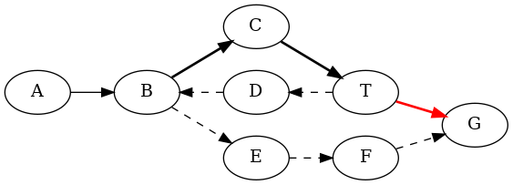

Raiden Specification
####################

.. toctree::
  :maxdepth: 2

Introduction
============

.. note:: This document, just like the Raiden protocol is a constant work in progress 

Raiden is a payment network built on top of the ethereum network. The goal of the Raiden project is to provide an easy to use conduit for off-chain payments without the need of trust among the involved parties.

While there are plans to extend Raiden to generalized state channels and channels with multiple parties, this documentation concerns only off-chain payment channels. 

How does the Raiden Network provide safety without trust?
---------------------------------------------------------

To achieve safety all value transfers done off-chain must be backed up by value stored in the blockchain. Off-chain payments would be susceptible to double spending if that was not the case. The payment channel is represented in the blockchain by a smart contract which:

- Provides shared rules, agreed up-front by both parties, for the channel operation.
- Holds the token value in escrow to back the off-chain payments.
- Arbitrates disputes using rules that cannot be abused by one party.

Given the above properties Raiden can safely do off-chain value transfers, knowing that once a dispute happens the smart contract can be used to settle and withdraw the token.

The netting channel smart contract
==================================

The netting channel smart contract is the executable code that contains the shared rules for operating an off-chain payment channel. These rules are implicitly agreed upon by each participant whenever a channel is used. The netting channel allows for:

- A large number of bidirectional value transfers among the channel participants.
- Conditional value transfers that have an expiration and predefined rules to withdraw.
- Rules to determine ordering of transfers.

Each netting channel backs a bi-directional off-chain payment channel. They deal with a predetermined token and each has its own settlement period configuration. Any of the two participants may deposit any number of times, any amount of the specified token.

Transfers may be conditionally finalized, meaning that at any given point in time there may be multiple in-flight transfers waiting to be completed. These transfers are represented by lock structures that contain a token amount, expiration, and hashlock. The set of all pending transfers is encoded in a merkle tree and represented in each transfer by its root.

The channel's capacity is equal to the total deposits by both participants. The capacity is both the largest value a transfer may have and the total amount of token in pending transfers. The capacity is divided as available and locked balance to each participant/direction. The available balances vary during the lifetime of the channel depending on the direction and value of the completed transfers. It can be increased either by a participant's deposit or by a counterparty's payment. The locked balance depends on the direction and value of the pending locked transfers. It is increased with each locked transfer and decreased when the transfer is finalized, successfully or otherwise.

A channel's life cycle
----------------------

- Deployment
- Funding / Usage
- Close
- Settle

After being deployed the channel may receive multiple deposits from either participant. Once the counterparty acknowledges it, the depositor may do transfers with the available balance.

Once either party wants to withdraw their tokens or a dispute arises the channel must be closed. After the close function is called the settlement window opens. Within the settlement window both participants must update the counterparty state and withdraw the unlocked locks. A party can not perform a partial withdrawal.

The ``transferUpdate()`` function call receives a signed balance proof which contains an envelope with channel specific data. These are the merkle tree root, the transferred_amount, and a nonce. Since a node can only provide a signed message from the counterparty we know the data wasn’t tampered with and is valid. To disincentivize a node from providing an older message, withdraw balances are netted from the transferred amount, a monotonically increasing value. As a consequence there are no negative value transfers, and if a participant provides an older message the wrongdoer's netted balance will be smaller.

A lock withdrawal is another netting channel operation, it receives an unlock proof composed of the lock data structure, a proof that this lock was contained in the merkle tree, and the secret that unlocks it. The channel validates the lock, checks the containment proof by recomputing the merkle tree root, and checks the secret, if all checks pass the transferred_amount of the counterparty is increased.

These are the channel properties: (without error checking)

# monotonically increasing
channel_capacity(p1, p2) = p1.total_deposit + p2.total_deposit
received(p) = partner(p).transferred_amonut
sent(p) = p.transferred_amount 

# derived values
netted_balance(p) = p.total_deposit + received(p) - sent(p)
available_balance(p) = netted_balance(p) - locked_balance(p)
locked_balance(p) = sum(lock.amount for lock in p.sent_pending_transfers)

# this follows as properties
netted_balance(p1) + netted_balance(p2) == channel_capacity(p1, p2)
available_balance(p) + locked_balance(p) == netted_balance(p)

Balance Proofs
--------------

The netting channel requires a balance proof containing the information to properly settle:

- nonce 
- transferred amount
- the root node of the pending locks merkle tree
- a signature containing all the above

For this reason each transfer must be encoded as a balance proof, this follows from the fact that transfer messages change the node balance and must be provable to the netting channel.

Raiden Transfers
================

Transfers in Raiden come in three different flavors.

Direct Transfers
----------------

A :term:`DirectTransfer` does not rely on locks to complete. It is automatically completed once the network packet is sent off. Since Raiden runs on top of an asynchronous network that can not guarantee delivery, transfers can not be completed atomically. The main points to consider about direct transfers are the following:

- These messages are not locked, meaning the envelope transferred_amount is incremented and the message may be used to withdraw the token. This means that a :term:`payer` is unconditionally transferring the token, regardless of getting a service or not. Trust is assumed among the payer/:term:`payee` to complete the goods transaction.

- The sender must assume the transfer is completed once the message is sent to the network, there is no workaround. The acknowledgement in this case is only used as a synchronization primitive, the payer will only know about the transfer once the message is received.

Mediated Transfers
------------------

A :term:`MediatedTransfer` is a hashlocked transfer. Currently raiden supports only one type of lock. The lock has an amount that is being transferred, a hash(secret) used to verify the secret that unlocks it, and an expiration to determine its validity.

Mediated transfers have an :term:`initiator` and a :term:`target` and a number of hops in between. The number of hops can also be zero.

Refund Transfers
----------------

  
A :term:`RefundTransfer` is a mediated transfers used in the special circumstance of when a node cannot make forward progress, and a routing backtrack must be done.

Third parties
=============

Third parties are required to provide for safe operation. Since a single node cannot be expected to have 100% up-time, third parties are required to operate the netting channels for the period of time the node is offline.

The purpose of a third party is to update the netting channel during settlement on behalf of a participant. For this reason Raiden must be configured to keep the third party up-to-date with its received transfers, locks, and secrets. If a channel is closed while this node is offline then the third party must be capable of calling updateTransfer/withdraw on its behalf.

A node cannot rely on only one third party to avoid collusion among it and the counterparty, and protect against DoS attacks. Given that a node relies on more than one third party, and that these services won’t have 100% uptime, out-of-sync third parties, that not always have the latest known balance proof, must be handled. The smart contract must have logic to totally order a stream of balance proofs from a single participant to do conflict resolution.

Additional problems can arise with the usage of multiple third parties. Because third parties can easily be impersonated, penalization is not an option for netting channels. If a user is using too many third parties, once a channel is closed there could be a `thundering herd <http://www.catb.org/jargon/html/T/thundering-herd-problem.html>`_ problem.

Mediating Transfers
===================

Raiden cannot rely on direct channels for most of its operations, especially if the majority of them are for target nodes that will only receive a transfer once. Mediated transfers are a form of value transfer that allows trustless cooperation among Raiden nodes to facilitate movement of value.

Mediated transfers rely on locks for safety. Locks can be unlocked only be knowledge of the secret behind it. This information is used to determine whether a transfer was complete and is shared among all nodes in a mediation chain. The lock operation allows each participant to safely finalize their transfers without requiring trust.

For a mediated transfer to work a number of nodes need to collaborate. Which nodes that would be is determined by the path, detailed in the transfer routing section of this document. TODO: Add link.

Let’s assume a path of Alice <-> Bob <-> Charlie, Alice does not have a direct channel with Charlie, therefore Alice can either open a new channel or mediate the transfer through other nodes. In our example Bob is a hop to whom Alice has an open channel and is considered good for routing.

The role of Bob is to mediate the transfer between Alice, the initiator, and Charlie, the target. The number of nodes in a given path may vary but the roles and guarantees work the same way.

Bob will first receive a mediated transfer (t1) from Alice. This transfer is conditionally locked with a secret generated by Alice so it’s on Alice’s hand whether to finalize the transfer or not. The transfer sent by Alice is a valid balance proof, that may be used by Bob on-chain at any time to reclaim the current received amount and if the unlocking secret is learned, to also withdraw the pending transfer t1. Because Bob knows that he may claim the transfer value, and Bob has properly done all the validation checks to guarantee that the balance proof contains the correct transferred amount, the merkle root effectively represents all pending transfers, and Alice does have the available balance to use with the given transfer, Bob can safely forward the transfer.

Bob will then create a new transfer t2, on the channel Bob <-> Charlie, t2 has it’s value backed up, since Bob is not the payer, by transfer t1. In the given example Alice is the payer to Bob, and Charlie is the payee to Bob. Note that in the case of an increased number of hops there will be more pairs (of payers, payees), one for each mediator. The transfer t2 will be another conditionally locked transfer, and the mediator is responsible to use the same lock amount and hash(secret) for this transfer.

Once the transfer target has received the mediated transfer it will request from the initiator the secret to unlock the transfer. At this point in time the initiator knows that some node will pay the target. The target informs the initiator about the received lock’s amount, token, and hash(secret), so it can be sure that it’s the correct transfer. Now the initiator Alice is at the position of completing the transfer by revealing the secret to Charlie.

Once the secret is known by the target the payments flow from the back to the front of the payment chain. That means starting at Charlie who will request a withdrawal from Bob, informing Bob about the known secret, allowing Bob to request a withdrawal from Alice.

.. topic:: Alternative Protocol Implementation
	   There is nothing about the way that locks operate that forbids transfer splitting, i.e.: a mediator doesn’t have enough capacity on a channel but it can forward the transfer to two or more channels that on aggregate have the correct amount.
	   Although that scheme is possible, it is not currently considered because of some added complexity. The target node would either need to know the transfer id and amount prior to it’s start, or it would need to make multiple secret requests to the initiator, as new transfers with the same hashlock arrives, until the correct transfer amount is reached.

Locks
=====

A lock has two parts, an amount used to track how much token is being locked, and rules to define how it may be unlocked. The lock itself is independent from the channel or token associated with it. What binds the lock to a specific channel is the balance proof’s merkle tree.

Raiden currently relies on hash time locks heavily. They are the essential ingredient for safe trustless mediated transfers. This kind of lock has two additional data attributes, a hash image and a expiration. The lock is unlocked if the preimage of the hash is revealed prior to its expiration. In raiden the preimage is called secret and it’s hash is called the hashlock. The secret is just 32 bytes of cryptographically secure random data. The hashlock can be the result of any cryptographically secure hash function but Raiden currently relies on the keccak hash function.

With this lock construct is possible to:

- Mediate token transfers, by relying on the same hashlock but different expiration times.
- Token swaps, two mediated transfers for different tokens are exchange and using the same hashlock.

.. topic:: Alternative Protocol Implementation
	   The preimage could be a hash of another structure, e.g. a written contract. This would bind the action of unlocking a lock release to a document.
	   The lock may required two hashlocks to unlock. This construct allows with a proper order allows receitps to be generate.
	   The lock may required either of two hashlocks to unlock. This construct allows for safe refunds that don’t need to wait for the lock expiration.

Safety of Mediated Transfers
============================

The safety of mediated transfers relies on two rules:

- For a node to withdraw a lock it must reveal the secret.
- The mediator must have time to withdraw the payer’s transfer after the payee withdrew the mediator’s transfer.

The first is trivially achieved by allowing two forms of withdraw, a node may withdraw off-chain by exchanging the secret message and receiving a balance proof, or on-chain by revealing the secret.

The second is the mediator’s responsibility to choose a lock expiration for the payer transfer that in the worst case allows the mediator to withdraw. The worst case is a withdraw on-chain that requires:

- Learning about the secret from the payee withdraw on-chain.
- Closing the channel.
- Updating the counter party transfer.
- Withdrawing the lock on the closed channel.

The number of blocks for the above is named :term:`reveal_timeout`.

.. topic:: Alternative Protocol Implementation
	   The reveal timeout is large because sudden bursts of ethereum transactions will saturate the block chain (after the block gas is used the block cannot append more transactions). This delays the processing of closing/withdraw transactions enough that token loss is possible. At the same time it is impossible to predict how long these bursts will be. Ideally the smart contract would be able compute the unlock operations that could have been executed and count lock expiration to the available gas slots.

Failed Mediated Transfers
=========================

Failed mediated transfers are defined as transfers for which the initiator does not reveal the secret, making it impossible to withdraw the lock. This may happen for two reasons, either the initiator didn’t receive a SecretRequest, or the initiator discarded the secret to retry the transfer with a different route.

The initiator might not have received the SecretRequest for yet another set of reasons:

- Connectivity problems between the initiator and the target.
- The maximum number of hops was reached, the lock.expiration cannot be further decremented so the last node is not willing to make progress.
- Some byzantine node along the path is not proceeding with the protocol.

For any of the above scenarios, each hop must hold the lock and wait until it expires before unlocking the token and letting the payer add it back to its available balance.

.. topic:: Alternative Protocol Implementation
	   Use a new lock type that can be withdrawn if any of two secrets is revealed. Each mediator sends the payee transfer with a controlled refund secret. If the next hop cannot proceed with the transfer it sends back a mediated transfer using the *same* refund hashlock. This allows the mediator controlling the refund secret to release both locks without a risk of double spending.

Channel Closing and Settlement
==============================

There are multiple reasons for which a channel might need to be closed:

- The partner node might be misbehaving
- The channel owner might want to withdraw its token.
- The partner node might become unresponsive and an unlocked transfer might be at risk of expiring.

At any point in time any of the participants may close the smart contract. From the point the channel is closed and onwards transfers can not be done using the channel.

Once the channel enters the settlement window the partner state can be updated by calling ``updateTransfer``. After the partner state is updated by the participant, locks may be withdrawn. A ``withdraw`` checks the lock and updates the partner's current transferred_amount. This is safe since a participant is allowed to provide the partner state only once and neither the transferred_amount nor the locksroot will change after that call.

With third parties the process changes slightly. Since third parties are allowed to call ``updateTransfer`` multiple times, the transferred_amount and locksroot must be reset each time a new transfer is provided, and locks that have been withdrawn must be withdrawn again.

.. topic:: Alternative Protocol Implementation
	   The current implementation has a local unlock, meaning that the same hashlock may be provided multiple times, once for each mediator that is closing the channel. The sprites [TODO: add link] approach uses a global registry of known secrets and requires the secret to be unlocked only once. This saves the computation of the hash function for each “additional” withdraw.
	   - a node doesn't need to close the channel to unlock, since the secret can be registered with the secret manager, that reduces the reveal timeout by ``Δ``
	   - a node doesn't need to care about learning the secret through the blockchain and reapplying it in it's own channel, the reduces the reveal timeout by ``x``
	   - it really simplifies thinking about lock expiration for refunds, since the expiration has a fixed lower bound.

Transfer Routing
================

Routing is a hard problem and because of the lack of a global view, Raiden has a graph search strategy. The packet routing may be looked at as an A* search, using the sorted path with capacity as an heuristic to do the packet routing.

Consider the above graph where each graph node represents a raiden node, each edge an existing channel, arrows represent the direction of the transfers, solid lines the current searched space of the graph, dashed lines the rest of the path and the red line an exhausted/closed channel.

The transfer initiator is A, the transfer target is G. A decides locally the first hop of the path. A’s choice is determined by what it thinks will be the path that can completes the transfer using the shortest path and sending the transfer to the first node.

B will mediate the transfer and do its own local path routing. It chose C, which is turn chose T. It turns out that both B and C made a suboptimal choice. T was not able to complete the transfer with its channel and will route the transfer through D, this will continue until either the transfer expires or the target is reached. Note that the transfer’s lock expiration is not the same as a protocol level TTL. This behaviour could improve if we `add a TTL to protocol messages <http://raiden-network.readthedocs.io/en/stable/>`_ so that we can inform mediators that a transfer was discarded by the initiator and further tries will be futile.

Each of these hops forwarded a MediatedTransfer, paying fees and sending the transfer value to the next hop to mediate the transfer.

.. topic:: Alternative Protocol Implementation
	   Path finding services: Nodes may choose routing services to update with their current available balance, the routing services will charge a fee to the users to provide routes.
	   Onion encryption: To improve anonymity, encryption may be used. The initiator will choose a path that cannot be changed during the transfer and onion encrypt the hops. Notes: garbage of a variable length must be added to the end of the onion encrypted path to hide the path length.

Merkle Tree
===========

.. image:: pics/merkletree.png

The `merkle tree <https://en.wikipedia.org/wiki/Merkle_tree>`_ data blocks are composed of the hashes of the locks. The unique purpose of the merkle tree is to have an ``O(log N)`` proof of containment and a constant ``O(1)`` storage requirement for the signed messages. The alternative is to have linear space ``O(n)`` for the signed messages (have a list of all the pending locks in each message).

The merkle tree must have a deterministic order, that can be computed by any participant or the channel contract. The leaf nodes are defined to be in lexicographical order of the elements (lock hashes). For the other levels the interior nodes are also computed from the lexicographical order.

.. topic:: Alternative Protocol Implementation
	   Use time order for the leaves and lexicographical for the intermediary nodes. This will greatly improve insertion performance since only the rightmost side of the tree must be recomputed. It may also improve removals since the nodes to the left don’t need to be recomputed.
