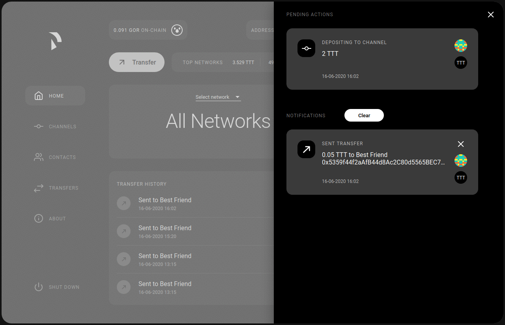

Raiden Web Interface Tutorial
#############################

The Raiden web interface (WebUI) helps you to interact with your Raiden node and aims to inspire to create own applications that utilize the Raiden REST API endpoints.

Run the Raiden web application
==============================

To run the WebUI you need to install Raiden and set up a Raiden node.
The easiest way to do so is by using the :doc:`quick start guide <../installation/quick-start/README>`.

**Once you have a Raiden node up and running the WebUI will be available
on** `http://localhost:5001 <http://localhost:5001/>`__\ **.**

.. include:: screens.inc.rst

.. include:: user-deposit.inc.rst

.. include:: join-a-token-network.inc.rst

.. include:: payment.inc.rst

.. include:: add-more-tokens.inc.rst

.. include:: close-channels-and-settle-payments.inc.rst
