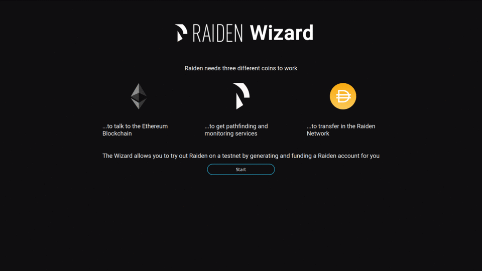

Quick Start on Görli Testnet
============================

You might want to try out Raiden on a testnet before using it on mainnet
or might need a development environment. For this reasons we provide a
stable demo environment on Görli. The quickest way to get a Raiden node
set up on this environment is to use the Raiden Wizard for Görli. This
page will guide you through the process.

Prerequisites 
--------------

In order to use the Raiden Wizard and Raiden you'll need:

-  A computer running **Linux** or **macOS**.
-  An Infura ID. Click
   :doc:`here <../installation/quick-start/infura-quick-start>` to get
   one.

Download the Wizard
-------------------

Click on your operating system to download the Wizard:

-  `macOS <https://github.com/raiden-network/raiden-wizard/releases/download/v1.1.0/raiden_wizard_goerli_macOS-1.1.0.tar.gz>`__
-  `Linux <https://github.com/raiden-network/raiden-wizard/releases/download/v1.1.0/raiden_wizard_goerli_linux-1.1.0.tar.gz>`__

Run the Wizard
--------------

1. Extract and run the ``raiden_wizard`` program.
2. Your web browser should open a new window with the Raiden Wizard. If
   not, you can manually type
   `http://localhost:2640 <http://localhost:2640>`__ to access the
   Wizard.

The Raiden Wizard will do the following for you:

-  Create a new Ethereum Account (the "Raiden Account") specifically for
   using with the Wizard.
-  Fund this new Raiden Account with ETH from a faucet.
-  Mint ``SVT`` tokens for using the pathfinding and monitoring
   services.
-  Mint ``WIZ`` tokens for making payments in the Raiden Network.
-  Launch your Raiden node.

.. note::

   Note that the Görli Wizard uses test tokens, so don’t be confused by the RDN and DAI symbols. 

Next steps
----------

After the completion of the Wizard you will get redirected to the web
interface of your Raiden node. See :ref:`this
page <webui>` for a guide to the
interface.

You can try to do your first payment by opening a channel with the
`Raiden Hub <https://hub.raiden.network/>`__
``0x1F916ab5cf1B30B22f24Ebf435f53Ee665344Acf`` and sending some WIZ
tokens to it. The payment should show up on the hub's
`webpage <https://hub.raiden.network>`__.

Restart your Raiden node
------------------------

After you have shut down your Raiden node, the Raiden Wizard can be used
as a launcher for your node. When you start the Wizard, it will
recognise that you already created a configuration for your node and
show a "Launch" button.

.. |image0| image:: ../.gitbook/assets/wizard_goerli.gif

