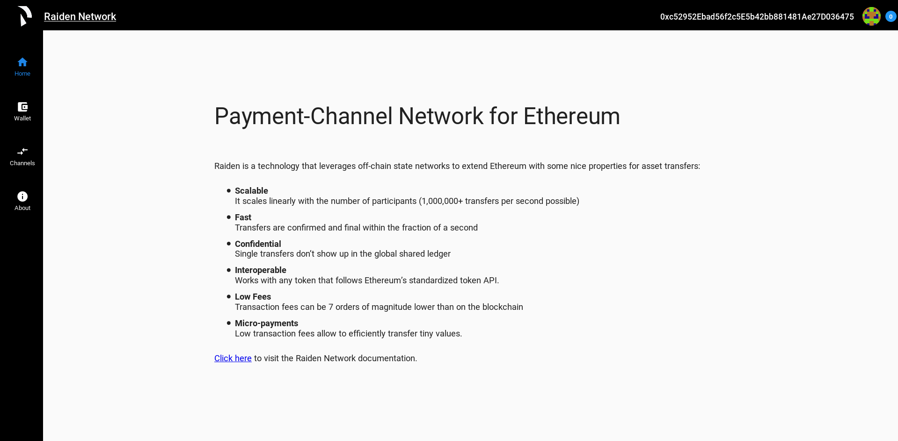

Web Application Tutorial
############################

In order to quickly give people an overview and idea of what the Raiden Developer Preview is capable of, a simple web application has been created. This application utilizes the :doc:`Raiden REST API endpoints <rest_api>` to allow the user to interact with tokens networks, transfer tokens, see the current status of open channels along with closing and settling channels to name some of the functionalities. For a more specific guide of the API itself see the :doc:`API Walkthrough <api_walkthrough>`.

The main focus of the web application is to display functionality and not to look pretty. Should you however want to make it pretty, don't hesitate to create a `pull request <https://github.com/raiden-network/raiden/pulls>`_.

Running the web application
---------------------------
There are a few simple steps that needs to be carried out in order to run the Raiden web application. Firstly, a Raiden node needs to be setup. See :doc:`overview_and_guide` for instructions on this.

The only dependency needed to run the web application is `node.js <https://docs.npmjs.com/getting-started/installing-node>`_.

Once a Raiden node is up and running and node.js has been installed, it is quite easy to start the web application::

    cd raiden/ui/web

Followed by::

    npm install

And then to run the application simply do::

    npm start

Now all that is left to do is to navigate to `localhost:4200 <localhost:4200>`_ and interaction with Raiden through a web application can begin.

The landing page
------------------
The first thing that will meet the user is the landing page. The landing page is meant to give a short introduction to Raiden and link to some relevant documentation. Furthermore it is also meant to provide an overview of some interesting statistics about Raiden.

Below is a screenshot of the landing page.

One last thing that might be interesting to note is that the address of the running Raiden node is always displayed in the top bar.

Channels
-------------
The ``Channels`` page is where a lot of the interesting stuff is going on. If a node has no open channels, not a lot of interesting information is displayed here. Under the ``Network Events`` tab it is however possible to see whenever a new token is registered. With no open channels the most interesting thing that can be done from this view is to manually open a new channel. This is done by pressing the ``Open Channel`` button and filling in the information in the pop up formula.

Once a channel is opened it will show up in the list of open channels. For each channel some relevant data is shown. The ``Channel``, ``Partner`` and ``Token`` fields represent the address of the payment channel itself, the address of the partner and the address of the token that the channel is opened with. Furthermore the ``Balance`` shows the amount of tokens that the Raiden node has available for the specific channel. The ``State`` represents the current state of the channel i.e. if it is opened, closed or settled. ``SettleTimeout`` and ``RevealTimeout`` shows the corresponding values that the channel was opened with. Lastly there is a menu button that represents the interactions that can be made with a channel.
``Transfer`` sends a transfer to the counterparty of the channel. ``Deposit`` allows the user to deposit more funds in the channel. ``Close`` closes the channel and updated the ``State`` of the channel to ``closed``. Once the channel is closed no more transfers can be carried out and the ``settle_timeout`` is initialised. Furthermore once the ``settle_timeout`` has expired ``Settle`` can be called. This will settle the channel and payout the correct amount of the deposit to each channel participant. Pressing ``Watch Events`` will open a new tab within the view that shows all event for the specific channel.

.. image:: images/raiden_webui_channels_view_screenshot.png
    :alt: Raiden web app channels page

Above is a screenshot of the ``Channels`` view with some open channels.

Tokens
----------
    * see token networks
    * register token
    * join token network
    * make token swap
    * leave token network
