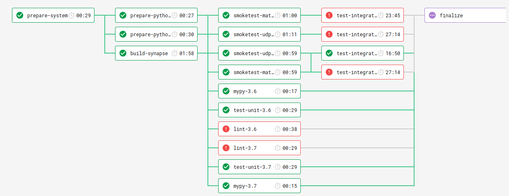

# Testing Review - Introductory Notes

This is the first code review of this kind I am doing - meaning: jumping into a big project I don't know yet in a problem domain that is completely unfamiliar to me with the mission to focus on testing.

I did not have an easy time getting into this and coming up with a way of doing this. I also looked at this from a lot of angles, as I couldn't just look at the tests in isolation. In the end, I spent considerably more time on this than I am billing, because I felt this would otherwise be completely useless to you.

I really want to thank you giving me the opportunity to do this!


To get an overview and a feel for the whole thing, I concentrated on basic things first, so quite a few things might be pointing out the obvious. If you have them on your radar already just pat yourself on the back and move on.

I also went rather broad than particularly deep to be able cover more ground.

Where I thought that it makes sense to comment right in context I added it there - grep for **ob-review**.

# Onboarding feedback

Very good!


I was able to run `raiden smoketest` and the tests successfully after following the install instructions for Arch Linux and the Python specific instructions.

## Suggestion

If possible: **make documentation executable.**

I created a tox env [`dev`](https://github.com/obestwalter/raiden-review/blob/b7eaf5fe7cd9de79f040e5cdc054f898724ff185/tox.ini#L51) to easily reinstall everything if needed. This makes the instructions even simpler (run `tox -e dev` and use that environment instead of a number of steps to go through). This also changes the docs maintained in different places into something executable which will then be automatically kept up to date if it changes, because the devs also use this for their work.

# Organisation of testing activities

I usually bundle all important (test)-automation steps in tox environments to have a single entry point for all developer activities and to keep things testable/debuggable locally as much as possible.

AFAIU a lot happening in the circle CI config is not circle CI specific and there is also a Makefile that takes over many things that I would expect to be a testenv in tox (e.g. lint).

There is also a different way how tests are started (`setup.py test`) from the Makefile as opposed to how they are started in tox (`pytest` directly).

I freely admit that I am heavily biased, but I would convert most of the makefile targets into tox environments - at least the ones that use Python tools and need some setup in a virtualenv anyway (like all the lint/test and documentation related targets). This might make this easier to digest to everyone involved. Adding descriptions to the tex environments then yields a quick overview what is going on by invoking `tox -av`.

# Test layout

* It might be worth thinking about [separating tests and code more](https://docs.pytest.org/en/latest/goodpractices.html#tests-outside-application-code) (where code also includes helpers for testing)
* I usually try to avoid having tests as packages, as you shouldn't import from test modules anyway, but this is also a matter of taste to a certain degree
* A comprehensive fixture system like yours might be better organized as internal plugins rather than a colletion of modules inside the test packages, that would also make it unnecessary to have the test folder as packages
* I usually also recommend the src layout for maturing projects to make sure you always tun the tests against the package (see [this article](https://hynek.me/articles/testing-packaging/)). It's a [contentious topic though](https://github.com/pypa/python-packaging-user-guide/issues/320) and some think it's not necessary or makes life even harder. tox and pytest recently adopted the src layout and it hasn't made my life harder in the slightest, but protects from accidentally testing the code in the project rather than in the package

# Static code analysis

For me, making good use of static code analysis is just as important as good tests, so I also want to make a few comments on that.

## mypy

For a project like this definitely a very good idea.

> We are starting small with a few files and directories here, but mypy should run on the whole codebase soon.

-- May 2018, Yoichi Hirai in your Makefile

### Suggestions

Gradually introducing this into the code base is a good approach but seems to drag on a bit so maybe looking into [pyannotate](https://github.com/dropbox/pyannotate) and get it over and done with in a concerted effort might be worth thinking about. Having a baseline to work with and having type hints everywhere makes it also easier for contributors to roll with it, I would reckon. The more I look at your code though, I get the impression that the transition is already further advanced than the actual checks suggest.

I also noticed that tests are not using the proper types in a quite a few places. This could also be handled right away. IMO tests should adhere to the same quality standards as production code.

## pylint / flake8

If I run pylint without the project configuration file I get tons of warnings, and there are 140 `pylint:` silencer comments in the code. It's hard to quantify these things, but my feeling is that the linting could be cranked up a notch rather than ignoring/silencing so many warnings, but I didn't look into that much further as this also a bit beside the point of what I am doing.

### Suggestion

How about unifying linting and adding automatic code formatting? Rather than having different calls in tox (only flake8 with `--exit-zero` and another lint environment in the Makefile, I would suggest to package that all up in a [pre-commit](https://pre-commit.com/) setup. This would be one environment for automatic fixing and linting with the extra benefits of a lot of useful little hooks to make life easier. The added benefit is that devs can install that as an actual pre-commit hook during development to prevent commits ending up on CI that should not end up there. Simple example in one of my projects: [config file](https://github.com/obestwalter/i3configger/blob/215c3023fec2464f4618a6327264585d9e0182b5/.pre-commit-config.yaml) and [tox env](https://github.com/obestwalter/i3configger/blob/dd55b1da4062f8eaf9e2d962eaf921c9744b1cbe/tox.ini#L24).

# About the tests

The test suite is complex and I can't say that I really understand what's going on a lot of the time, but it seems really decent overall. For a software like Raiden Network that must be very tricky to test this seems appropriate.

Good use is being made of the pytest fixture mechanism and inbuilt fixtures. Good care was taken to name the tests well and to pull out helpers where it makes sense. If anything I would say there might be a bit too much of that going on in certain places, but I commented about these things in the code directly.

Things can always be improved but overall on first view this looks like a really good suite.

## Suggestion: Given-When-Then

To improve the comprehensibility of tests that are quite involved or hard to understand, you could think about adding a higher level description in a docstring following [Given-When-Then](https://en.wikipedia.org/wiki/Given-When-Then). I wouldn't recomment that for "normal" tests, but for quite a few of the integration tests it might be a good idea (also linking to relevant docs specifying protocols under test if applicable). This way it might also become clearer where tests overlap in what they are actually trying to test.

## Suggestion: Naming things

One thing that helps communicating fixture behaviour and resulting data better is using the `name` keyword for fixtures. e.g. a fixture creating a database and returning the connection could look like this:

```python
@pytest.fixture(name="db_connection", scope="session")
def create_postgres_db():
    ...
```

The function name describes what is being done and the name describes what kind of object is injected into the test.

## Very creative way to pass values around

```python
@pytest.mark.parametrize('number_of_nodes', [1])
@pytest.mark.parametrize('channels_per_node', [0])
def test_payload_with_address_invalid_chars(test_api_server):
    ...
```

I have to admit that when I saw this, I had no clue what was going on. Also the variables
that are basically a lot of fixtures returning constants where a mystery to me.

In my understading, parametrizing a test with only one parameter is not doing anything other than generating a different name for the single test. If that parameter is not even used in the test that means that there either black magic is going on or there removal was forgotten during a refactoring. In this case it's black magic I guess (at least to me).

So what you are doing is basically sending the value from the top fixture from the test up to some other test relying on this behaviour ... right?

```python
import pytest

@pytest.fixture
def top():
    return 1

@pytest.fixture
def mid(top):
    return top

def test_original(mid):
    assert 0, mid  # -> "1"

@pytest.mark.parametrize("top", [2])
def test_overwritten(mid):
    assert 0, mid  # -> "2"

```

This is definitely a very creative abuse of the parametrization system to communicate values up the dependency chain, but I feel this would better be replaced with a different approach to setting up the system for a test.

For one: due to this entanglement it is pretty much impossible to have fixtures with scopes greater than function because pretty much everything depends on these function scoped magic parameter passing parametrization fixtures.

It also makes the whole system pretty much opaque to even experienced users of pytest.

# Simplifying The Fixture System

## Suggestion: communicate per-test configuration differently

IMO this has the most potential to get to a simpler system. Other simplifications might emerge from that. I 'll sketch out a different way to communicate values to fixtures a test depends on. If I had the time to go deeper, I would attempt to think about why this is even necessary, but for now this must suffice even running the danger that I am trying to help treating a symptom here, rather than looking for a cause.

The main advantages I would see in refactoring would be:

* configuration of a test does not force all fixtures used by that test into having function scope anymore
* Making explicit what is going on, makes the tests easier to understand

## Step 1

Identify fixtures that are really just constants and are never overwritten and turn them into constants. This might just be a handful of fixtures, but it is a handful of fixtures less in an already quite impressive dependency tree.

## Step 2

Collect all fixtures that are actually per-test-configuration (mainly for the "god fixture" raiden_network) into a configuration object that has sensible defaults (which are now the original return value of the fixtures).

This could also take care of the `skip_*` fixtures that are used to filter out tests already on collection time.

## Step 3

Use a different way to pass this config object to the fixture that needs it. The obvious choice here to me is to make more extensive use of `pytest_generate_tests` which already used to skip tests and to parametrize `transport` and `private_rooms`.

Rather than having a ton of fixtures all taking care of one aspect of the test configuration there would be one configuration object taking care of all these aspects (should it be skipped under certain circumstances? Which kind of dynamic parametrization is needed, etc.)

This should also be well documented as this is a non obvious use of the testing mechanisms to people who are not deeply into how pytest works.

I can't flesh this out more as I am really running out of time, but I think the idea is clear.

## Suggestion: look deeper into the dependencies of the fixtures

This is vague but generally questioning the interwoven dependencies might help - I commented in the `netting_channel_state` fixture as one example for that.

Maybe it makes sense to merge certain fixtures to simplify things?

**caveat:** I might be horribly wrong, because this is really hard to judge without having a deeper insight into the system under test

I am afraid that after this short time, I have no clear idea how to go about this. A lot depends on what is possible to do when a basic system is set up, meaning, what is mutable and what is immutable and how setups can be simplified by having more one-size-fits-all (or at least many) fixtures that reduces the number of different setups needed for different tests. Grouping tests by the kind of precondition they need might be worth looking at. But I am really just guessing here, as I lack the deeper understanding.

# Testing best practices?

**Disclaimer: highly opinionated and with only a shallow understanding of the specifics of your project. There have been books written about that by much smarter and experienced people than me, but I'll try ...**

## Smaller (unit?) vs larger (integration?) tests

I am actually a big fan of functional tests that test a larger part of the system. In a lot of messy real life applications it is much easier and safer to concentrate more on those high level tests that make sure that you keep your promise to the customer and cause no catastrophic failures.

Lower level tests are helpful for development and very important to test the (logic heavy) critical parts of the system. Not everything needs to be covered by those kinds of tests.

Religious wars can be fought over the definition of what are unit tests, what are integration tests and so on. To me the terms "unittest" or "integration test" have no inherent meaning, they need to be made sense of in the context of the system where they are used. So, finding helpful terminology and an appropriate mix of tests needs to be done for each individual system and is often only possible after a test suite has grown and patterns have emerged. Google is by no means a blueprint for how everybody should name their tests - I'd just like to link to this article as one example for going about it that I like: [Test Sizes ](https://testing.googleblog.com/2010/12/test-sizes.html).

### Looking at some unittests

Tests in [test_operators.py](../raiden/tests/unit/test_operators.py) look like "proper" unit tests to me, but they could be split up in more tests, named after what specifically they are testing. I am not opposed to having more than one assert in the test, if they all test the same thing, but e.g. in `test_event_operators` it looks to me like those are several tests in one test function.

Tests in [test_sqlite.py](../raiden/tests/unit/test_sqlite.py) is something that looks like a higher level test that already tests how several units of the system play together. E.g. maybe a test like `test_get_event_with_balance_proof` could be called a protocol test? It iterates over a series of events and asserting on them step by step. Another indication is that there is quite a lot of setup code and quite a few internal objects and functions in use.

In contrast `BalanceProofUnsignedState` is used but I can't find any tests that test this class in (reasonable) isolation.

I'd suggest looking at which important entities in the system are not yet tested directly in isolation.

### Looking at some integration tests

I guess the criterion for what makes an integration test is that it needs some kind of server/service running with which to communicate, which is perfectly valid, but maybe not enough in the long run to organize tests in a meaningful way? E.g. [test_matrix_transport.py](../raiden/tests/integration/test_matrix_transport.py): to an uninitiated reader like me this also looks pretty much like being in the same league like `test_sqlite` - some non trivial multi-step behaviour between parts of the system is tested, so another protocol test that happens to use a running matrix server?

## How to concentrate more on unhappy path testing?

This might be a bit vague. I would go about this by asking this question more often: "What is the worst that could happen here?" or "What absolutely must under no circumstance go wrong here?". Asking yourself or each other these question might lead to more unhappy paths being considered and also how to prevent the worst from happening if those unhappy paths are hit.

## How To introduce more inside out tests

An incremental approach would be: if an integration test fails, ask yourself what could have been tested on a lower level to catch that problem earlier and write that test(s). Over time there will be a greater coverage of lower levels.

If and when integration tests might be superfluous then is harder question to answer and I prefer to err on the side of testing too much than testing too little for a critical system (or critical part of a system).

I think you are already doing (have done) that but splitting up the system into clear subsystems with clear interfaces makes testing in isolation and direct interaction between them easier and more lightweight. This [issue](https://github.com/raiden-network/raiden/issues/3252) gives me the feeling that things like that are already being considered.

# Speeding up integration tests

## Looking at an arbitrary integration test

I chose `test_invalid_close` to have a closer look.

### Profiling

Naively trying to profile via PyCharm yielded:

```
Testing started at 6:11 PM ...
/home/ob/oss/raiden-dev/raiden-review/.tox/dev/bin/python /home/ob/opt/pycharm-2018.2/helpers/profiler/run_profiler.py 127.0.0.1 43041 /home/ob/opt/pycharm-2018.2/helpers/pycharm/_jb_pytest_runner.py --target test_balance_proof_check.py::test_invalid_close
Starting cProfile profiler
Launching pytest with arguments test_balance_proof_check.py::test_invalid_close in /home/ob/oss/raiden-dev/raiden-review/raiden/tests/integration

/home/ob/oss/raiden-dev/raiden-review/raiden/tests/conftest.py:9: MonkeyPatchWarning: Monkey-patching ssl after ssl has already been imported may lead to errors, including RecursionError on Python 3.6. It may also silently lead to incorrect behaviour on Python 3.7. Please monkey-patch earlier. See https://github.com/gevent/gevent/issues/1016. Modules that had direct imports (NOT patched): ['thriftpy.transport._ssl (/home/ob/opt/pycharm-2018.2/helpers/profiler/thriftpy/transport/_ssl.py)']. 
  monkey.patch_all()
ImportError while loading conftest '/home/ob/oss/raiden-dev/raiden-review/raiden/tests/conftest.py'.
RuntimeError: cannot release un-acquired lock
Snapshot saved to /home/ob/.PyCharm2018.2/system/snapshots/raiden-review.pstat

Process finished with exit code 0
Empty test suite.
```

As @ulope said, this is likely to do with gevent based concurrency, so is not trivial to do.

### Eyeballing it

`pytest --durations 1 -k test_insufficient_funds`

```
43.55s setup    raiden/tests/integration/test_pythonapi.py::test_insufficient_funds[udp-None-1-2]
0.08s teardown raiden/tests/integration/test_pythonapi.py::test_insufficient_funds[udp-None-1-2]
0.01s call     raiden/tests/integration/test_pythonapi.py::test_insufficient_funds[udp-None-1-2]
```

0.02% of the test time is spent in the actual test.

Looking a bit closer:

```
============================= test session starts ==============================
platform linux -- Python 3.6.7, pytest-3.10.1, py-1.6.0, pluggy-0.7.1
hypothesis profile 'default' -> database=DirectoryBasedExampleDatabase('/home/ob/oss/raiden-dev/raiden-review/.hypothesis/examples')
rootdir: /home/ob/oss/raiden-dev/raiden-review, inifile: tox.ini
plugins: timeout-1.2.1, random-0.2, cov-2.5.1, hypothesis-3.80.0
timeout: 540.0s method: signal
collected 469 items / 468 deselected

raiden/tests/integration/test_pythonapi.py 
SETUP    S dont_exit_pytest
SETUP    S enable_greenlet_debugger
SETUP    S logging_level
SETUP    S port_generator
SETUP    S tmpdir_factory
        SETUP    F number_of_nodes[2]
        SETUP    F deposit
        SETUP    F token_amount (fixtures used: deposit, number_of_nodes)
        SETUP    F number_of_tokens
        SETUP    F privatekey_seed
        SETUP    F private_keys (fixtures used: number_of_nodes, privatekey_seed)
        SETUP    F deploy_key (fixtures used: privatekey_seed)
        SETUP    F blockchain_number_of_nodes
        SETUP    F blockchain_rpc_ports (fixtures used: blockchain_number_of_nodes, port_generator)
        SETUP    F blockchain_p2p_ports (fixtures used: blockchain_number_of_nodes, port_generator)
        SETUP    F blockchain_key_seed
        SETUP    F blockchain_private_keys (fixtures used: blockchain_key_seed, blockchain_number_of_nodes)
        SETUP    F blockchain_type
        SETUP    F random_marker
        SETUP    F tmpdir (fixtures used: tmpdir_factory)
        SETUP    F chain_id
        SETUP    F web3 (fixtures used: blockchain_p2p_ports, blockchain_private_keys, blockchain_rpc_ports, blockchain_type, chain_id, deploy_key, private_keys, random_marker, tmpdir)
        SETUP    F deploy_client (fixtures used: blockchain_rpc_ports, deploy_key, web3)
        SETUP    F environment_type
        SETUP    F contract_manager (fixtures used: environment_type)
        SETUP    F deploy_service (fixtures used: contract_manager, deploy_client, deploy_key)
        SETUP    F secret_registry_address (fixtures used: contract_manager, deploy_client)
        SETUP    F settle_timeout_min
        SETUP    F settle_timeout_max
        SETUP    F token_network_registry_address (fixtures used: chain_id, contract_manager, deploy_client, secret_registry_address, settle_timeout_max, settle_timeout_min)
        SETUP    F register_tokens
        SETUP    F token_addresses (fixtures used: contract_manager, deploy_service, number_of_tokens, private_keys, register_tokens, token_amount, token_network_registry_address)
        SETUP    F channels_per_node[1]
        SETUP    F reveal_timeout (fixtures used: number_of_nodes)
        SETUP    F settle_timeout (fixtures used: reveal_timeout)
        SETUP    F blockchain_services (fixtures used: contract_manager, deploy_service, private_keys, secret_registry_address, token_network_registry_address, web3)
        SETUP    F endpoint_registry_address (fixtures used: contract_manager, deploy_client)
        SETUP    F endpoint_discovery_services (fixtures used: blockchain_services, endpoint_registry_address)
        SETUP    F raiden_udp_ports (fixtures used: number_of_nodes, port_generator)
        SETUP    F database_paths (fixtures used: private_keys, tmpdir)
        SETUP    F retry_interval
        SETUP    F retries_before_backoff
        SETUP    F throttle_capacity
        SETUP    F throttle_fill_rate
        SETUP    F nat_invitation_timeout
        SETUP    F nat_keepalive_retries
        SETUP    F nat_keepalive_timeout
        SETUP    F unrecoverable_error_should_crash
        SETUP    F transport[udp]
        SETUP    F transport_config (fixtures used: transport)
        SETUP    F local_matrix_server (fixtures used: transport_config)
        SETUP    F private_rooms[None]
        SETUP    F retry_timeout
        SETUP    F raiden_network (fixtures used: blockchain_services, chain_id, channels_per_node, 
                                   database_paths, deposit, endpoint_discovery_services, 
                                   environment_type, local_matrix_server, nat_invitation_timeout,
                                   nat_keepalive_retries, nat_keepalive_timeout, private_rooms, 
                                   raiden_udp_ports, retries_before_backoff, retry_interval, 
                                   retry_timeout, reveal_timeout, settle_timeout, throttle_capacity,
                                   throttle_fill_rate, token_addresses, token_network_registry_address,
                                   unrecoverable_error_should_crash)
                            raiden/tests/integration/test_pythonapi.py::test_insufficient_funds[udp-None-1-2]
                                 (fixtures used: blockchain_key_seed, blockchain_number_of_nodes, 
                                  blockchain_p2p_ports, blockchain_private_keys, blockchain_rpc_ports,
                                  blockchain_services, blockchain_type, chain_id, channels_per_node, 
                                  contract_manager, database_paths, deploy_client, deploy_key, deploy_service,
                                  deposit, dont_exit_pytest, enable_greenlet_debugger, endpoint_discovery_services,
                                  endpoint_registry_address, environment_type, local_matrix_server, 
                                  logging_level, nat_invitation_timeout, nat_keepalive_retries, 
                                  nat_keepalive_timeout, number_of_nodes, number_of_tokens, 
                                  port_generator, private_keys, private_rooms, privatekey_seed, 
                                  raiden_network, raiden_udp_ports, random_marker, register_tokens,
                                  retries_before_backoff, retry_interval, retry_timeout, reveal_timeout,
                                  secret_registry_address, settle_timeout, settle_timeout_max, 
                                  settle_timeout_min, throttle_capacity, throttle_fill_rate, tmpdir, 
                                  tmpdir_factory, token_addresses, token_amount, token_network_registry_address,
                                  transport, transport_config, unrecoverable_error_should_crash, web3).
        TEARDOWN F raiden_network
        TEARDOWN F retry_timeout
        TEARDOWN F private_rooms[None]
        TEARDOWN F local_matrix_server
        TEARDOWN F transport_config
        TEARDOWN F transport[udp]
        TEARDOWN F unrecoverable_error_should_crash
        TEARDOWN F nat_keepalive_timeout
        TEARDOWN F nat_keepalive_retries
        TEARDOWN F nat_invitation_timeout
        TEARDOWN F throttle_fill_rate
        TEARDOWN F throttle_capacity
        TEARDOWN F retries_before_backoff
        TEARDOWN F retry_interval
        TEARDOWN F database_paths
        TEARDOWN F raiden_udp_ports
        TEARDOWN F endpoint_discovery_services
        TEARDOWN F endpoint_registry_address
        TEARDOWN F blockchain_services
        TEARDOWN F settle_timeout
        TEARDOWN F reveal_timeout
        TEARDOWN F channels_per_node[1]
        TEARDOWN F token_addresses
        TEARDOWN F register_tokens
        TEARDOWN F token_network_registry_address
        TEARDOWN F settle_timeout_max
        TEARDOWN F settle_timeout_min
        TEARDOWN F secret_registry_address
        TEARDOWN F deploy_service
        TEARDOWN F contract_manager
        TEARDOWN F environment_type
        TEARDOWN F deploy_client
        TEARDOWN F web3
        TEARDOWN F chain_id
        TEARDOWN F tmpdir
        TEARDOWN F random_marker
        TEARDOWN F blockchain_type
        TEARDOWN F blockchain_private_keys
        TEARDOWN F blockchain_key_seed
        TEARDOWN F blockchain_p2p_ports
        TEARDOWN F blockchain_rpc_ports
        TEARDOWN F blockchain_number_of_nodes
        TEARDOWN F deploy_key
        TEARDOWN F private_keys
        TEARDOWN F privatekey_seed
        TEARDOWN F number_of_tokens
        TEARDOWN F token_amount
        TEARDOWN F deposit
        TEARDOWN F number_of_nodes[2]
TEARDOWN S tmpdir_factory
TEARDOWN S port_generator
TEARDOWN S logging_level
TEARDOWN S enable_greenlet_debugger
TEARDOWN S dont_exit_pytest
```

That's an impressive graph and that raiden_network fixture looks genuinely scary ...

Most time spent in (from longest to shortest - eyeball wise):

* retry_timeout (by a big margin the longest time is spent here)
* register_tokens
* chain_id
* blockchain_services
* deploy_service
* settle_timeout_max

All other fixture cost a negligible amount of time

As @hackaugusto mentioned most time is likely spent in production code setting up what is necessary, so I didn't spend more time looking into this deeper.

## Suggestions

Every integration test setup takes ~43 seconds. As most time is spent in production code and those setup activities are all necessarily function scoped for the time being, there is not much wiggle room here.

### Short Term

I hope this doesn't sound to naive, but it really is the only thing I can come up with at the moment and I am sure you will already have thought of that, but I can't not say it: throw (more) money at your CI provider and parallelize massively. Split the integration tests into several groups running on different machines (e.g. via using module level markers).

Looking at one of the last builds:



I do not know CircleCi, but this surprises me as I would expect the workflow to not advance to the next stage if there were any errors. I would not even bother running anything else if anything fails in a prior stage. Wouldn't that already take some load of CI?

The last stage (integrationtests) looks like parallelizing more there would help.

Also: consider moving the longest running tests that slow down the whole test suite into a nightly build rather than also running them on each build. That might make it necessary to rerun them for different changesets if things break and it is otherwise hard to find the problem, but that might be worth it.

### Longer Term

* Based on profiling, see where time can be shaved off, maybe there are some easy wins that aren't obvious?
* Bundle tests in groups where larger scopes can be used for slow fixtures
* Look into mocking the most time consuming bit (creating a fresh blockchain) in a reliable way -> if you open source that please call it **mockchain** :D (I guess very hard to do though? No idea.)

# Further Random Remarks

* One of the most knowledgeable people I know regarding pytest is @niccodemus (Bruno Oliveira) and he lives in Florianopolis just like you Augusto. Invite him to a beer and have a chat :) Say hello from me :)
* I always like to see links to issues that are being addressed by regression tests this is definitely a good practice to follow
* some [helper code](raiden/tests/unit/fuzz/test_state_changes.py) in the tests looks like you will be needing tests for the tests at some point :D
* I find it a bit annoying that logs are cluttered everywhere after tests - wouldn't they be better put into a fixed `logs` folder in the root of the project?

## Python: use `_` for unused names

There are a few places in the code where this convention is used, but I saw quite a few places where e.g. `**kwargs` are collected in a function head but are not used. The resulting linter warning is silenced with `# pylint: disable=unused-argument`. This should not be necessary if using that convention also in those cases - e.g. `**_`. Then the linter does not need to be silenced either which results in less visual noise in the code. Might be a conscious decision though, but I thought I'd mention it.

## Keep up with current versions of pytest

Constraint is 3.10.1 - current version is 4.1.2.

I have a hunch that this has to do with the deprecations turning into errors with pytest 4. Although you have about 80 deprecation warnings I think this should be tackled rather sooner than later. It might look like more work than it actually is.

## Code Complexity (McCabe)

> One of McCabe's original applications was to limit the complexity of routines during program development; he recommended that programmers should count the complexity of the modules they are developing, and split them into smaller modules whenever the cyclomatic complexity of the module exceeded 10.

-- https://en.wikipedia.org/wiki/Cyclomatic_complexity#Limiting_complexity_during_development

`flake8 raiden/ --max-complexity 10`

```
raiden/api/rest.py:543:5 'RestAPI.open'  (11)
raiden/api/python.py:243:5 'RaidenAPI.channel_open'  (11)
raiden/network/upnpsock.py:73:1 'open_port'  (11)
raiden/transfer/node.py:890:1 'is_transaction_effect_satisfied'  (11)
raiden/network/transport/matrix.py:690:5 'MatrixTransport._handle_invite'  (11)
raiden/network/transport/udp/healthcheck.py:29:1 'healthcheck'  (11)
raiden/log_config.py:143:1 'configure_logging'  (12)
raiden/accounts.py:80:5 'AccountManager.__init__'  (12)
raiden/routing.py:20:1 'get_best_routes'  (12)
raiden/utils/cli.py:346:1 'apply_config_file'  (12)
raiden/tests/conftest.py:166:1 'If 166'  (12)
raiden/ui/config.py:11:1 '_clean_non_serializables'  (12)
raiden/network/rpc/client.py:397:5 'JSONRPCClient.deploy_solidity_contract'  (12)
raiden/transfer/state.py:730:5 'BalanceProofUnsignedState.__init__'  (13)
raiden/network/transport/matrix.py:533:5 'MatrixTransport._login_or_register'  (13)
raiden/network/transport/matrix.py:617:5 'MatrixTransport._join_discovery_room'  (14)
raiden/ui/prompt.py:9:1 'prompt_account'  (15)
raiden/network/rpc/smartcontract_proxy.py:30:1 'inspect_client_error'  (15)
raiden/network/transport/matrix.py:1436:5 'MatrixTransport._leave_unused_rooms'  (16)
raiden/raiden_event_handler.py:66:5 'RaidenEventHandler.on_raiden_event'  (17)
raiden/transfer/state.py:869:5 'BalanceProofSignedState.__init__'  (19)
raiden/ui/cli.py:453:1 'smoketest'  (19)
raiden/ui/runners.py:77:5 'NodeRunner._start_services'  (20)
raiden/network/transport/matrix.py:781:5 'MatrixTransport._handle_message'  (25)
raiden/ui/app.py:168:1 'run_app'  (28)
raiden/transfer/node.py:739:1 'handle_state_change'  (30)
```

* 26 functions with a complexity higer than 10
* 5 of which with a complety higer than 15

The complexity check seems to be disabled in normal test runs.

A quick look at a few of the really "complex" ones showed that this is usually
simple dispatch code for which this kind of complexity is fine, but maybe they
should be marked as ignored individually and the overall check activated again?

## Dead code?

Might be worth having a look with e.g. [vulture](https://github.com/jendrikseipp/vulture) (needs double checking)

```
$ vulture --exclude raiden/tests --sort-by-size raiden
```

(left out tests here, because vulture has no clue about fixtures, so most of this is noise)

I did not look closer at the validity of this, but if there are a lot of false positives that means that the code is very dynamic (good when really necessary but makes comprehension harder).

```
raiden/api/objects.py:31: unused attribute 'partner_address' (60% confidence, 1 line)
raiden/api/objects.py:32: unused attribute 'channel' (60% confidence, 1 line)
raiden/api/rest.py:356: unused attribute 'flask_api_context' (60% confidence, 1 line)
raiden/api/v1/encoding.py:46: unused variable 'default_error_messages' (60% confidence, 1 line)
raiden/api/v1/encoding.py:93: unused variable 'OPTIONS_CLASS' (60% confidence, 1 line)
raiden/api/v1/encoding.py:104: unused variable 'OPTIONS_CLASS' (60% confidence, 1 line)
raiden/api/v1/encoding.py:130: unused variable 'strict' (60% confidence, 1 line)
raiden/api/v1/encoding.py:140: unused variable 'strict' (60% confidence, 1 line)
raiden/api/v1/encoding.py:149: unused variable 'strict' (60% confidence, 1 line)
raiden/api/v1/encoding.py:157: unused variable 'strict' (60% confidence, 1 line)
raiden/api/v1/encoding.py:166: unused variable 'strict' (60% confidence, 1 line)
raiden/api/v1/encoding.py:174: unused variable 'strict' (60% confidence, 1 line)
raiden/api/v1/encoding.py:206: unused variable 'strict' (60% confidence, 1 line)
raiden/api/v1/encoding.py:217: unused variable 'strict' (60% confidence, 1 line)
raiden/api/v1/encoding.py:235: unused variable 'strict' (60% confidence, 1 line)
raiden/api/v1/encoding.py:241: unused variable 'initiator_address' (60% confidence, 1 line)
raiden/api/v1/encoding.py:248: unused variable 'strict' (60% confidence, 1 line)
raiden/api/v1/encoding.py:260: unused variable 'strict' (60% confidence, 1 line)
raiden/api/v1/encoding.py:266: unused variable 'strict' (60% confidence, 1 line)
raiden/api/v1/encoding.py:280: unused variable 'strict' (60% confidence, 1 line)
raiden/api/v1/encoding.py:294: unused variable 'strict' (60% confidence, 1 line)
raiden/api/v1/encoding.py:308: unused variable 'strict' (60% confidence, 1 line)
raiden/app.py:137: unused attribute 'start_console' (60% confidence, 1 line)
raiden/app.py:141: unused attribute 'services' (60% confidence, 1 line)
raiden/constants.py:8: unused variable 'MIN_REQUIRED_SOLC' (60% confidence, 1 line)
raiden/constants.py:10: unused variable 'INT64_MAX' (60% confidence, 1 line)
raiden/constants.py:29: unused variable 'ETH_RPC_DEFAULT_PORT' (60% confidence, 1 line)
raiden/constants.py:30: unused variable 'HTTP_PORT' (60% confidence, 1 line)
raiden/constants.py:31: unused variable 'HTTPS_PORT' (60% confidence, 1 line)
raiden/constants.py:33: unused variable 'START_QUERY_BLOCK_KEY' (60% confidence, 1 line)
raiden/exceptions.py:132: unused attribute 'error_code' (60% confidence, 1 line)
raiden/log_config.py:106: unused variable 'method_name' (100% confidence, 1 line)
raiden/network/proxies/discovery.py:53: unused attribute 'not_found_address' (60% confidence, 1 line)
raiden/network/sockfactory.py:21: unused attribute 'meta' (60% confidence, 1 line)
raiden/network/sockfactory.py:55: unused attribute 'method_args' (60% confidence, 1 line)
raiden/network/sockfactory.py:100: unused variable 'exc_tb' (100% confidence, 1 line)
raiden/network/sockfactory.py:100: unused variable 'exc_type' (100% confidence, 1 line)
raiden/network/sockfactory.py:100: unused variable 'exc_val' (100% confidence, 1 line)
raiden/network/transport/matrix.py:351: unused attribute '_message_handler' (60% confidence, 1 line)
raiden/network/upnpsock.py:45: unused attribute 'discoverdelay' (60% confidence, 1 line)
raiden/network/upnpsock.py:95: unused variable 'attr1' (60% confidence, 1 line)
raiden/network/upnpsock.py:95: unused variable 'attr2' (60% confidence, 1 line)
raiden/raiden_service.py:236: unused attribute 'pubkey' (60% confidence, 1 line)
raiden/raiden_service.py:269: unused attribute 'serialization_file' (60% confidence, 1 line)
raiden/settings.py:9: unused variable 'GAS_LIMIT_HEX' (60% confidence, 1 line)
raiden/settings.py:10: unused variable 'GAS_PRICE' (60% confidence, 1 line)
raiden/settings.py:34: unused variable 'DEFAULT_WAIT_FOR_SETTLE' (60% confidence, 1 line)
raiden/settings.py:36: unused variable 'DEFAULT_CHANNEL_SYNC_TIMEOUT' (60% confidence, 1 line)
raiden/storage/sqlite.py:25: unused variable 'event_identifier' (60% confidence, 1 line)
raiden/storage/sqlite.py:39: unused attribute 'text_factory' (60% confidence, 1 line)
raiden/transfer/mediated_transfer/state.py:286: unused variable 'valid_states' (60% confidence, 1 line)
raiden/transfer/state.py:67: unused variable 'CHANNEL_ALL_VALID_STATES' (60% confidence, 1 line)
raiden/ui/app.py:192: unused variable 'extra_config' (100% confidence, 1 line)
raiden/ui/console.py:58: unused attribute '_current_gui' (60% confidence, 1 line)
raiden/ui/console.py:74: unused attribute '_current_gui' (60% confidence, 1 line)
raiden/ui/console.py:104: unused attribute 'formatter' (60% confidence, 1 line)
raiden/ui/runners.py:49: unused attribute '_ctx' (60% confidence, 1 line)
raiden/utils/cli.py:137: unused attribute 'option_group' (60% confidence, 1 line)
raiden/utils/cli.py:313: unused variable 'idpattern' (60% confidence, 1 line)
raiden/utils/typing.py:27: unused variable 'BlockGasPrice' (60% confidence, 1 line)
raiden/api/v1/encoding.py:41: unused function 'to_url' (60% confidence, 2 lines)
raiden/api/v1/encoding.py:53: unused function '_serialize' (60% confidence, 2 lines)
raiden/api/v1/encoding.py:75: unused function '_serialize' (60% confidence, 2 lines)
raiden/api/v1/encoding.py:78: unused function '_deserialize' (60% confidence, 2 lines)
raiden/api/v1/encoding.py:189: unused function 'get_partner_address' (60% confidence, 2 lines)
raiden/api/v1/encoding.py:198: unused function 'get_state' (60% confidence, 2 lines)
raiden/network/rpc/smartcontract_proxy.py:181: unused function 'encode_function_call' (60% confidence, 2 lines)
raiden/network/sockfactory.py:129: unused function 'unmap_upnp' (60% confidence, 2 lines)
raiden/network/sockfactory.py:145: unused function 'unmap_stun' (60% confidence, 2 lines)
raiden/network/sockfactory.py:160: unused function 'unmap_none' (60% confidence, 2 lines)
raiden/network/sockfactory.py:163: unused function 'map_ext' (60% confidence, 2 lines)
raiden/network/sockfactory.py:166: unused function 'unmap_ext' (60% confidence, 2 lines)
raiden/transfer/views.py:81: unused function 'state_from_app' (60% confidence, 2 lines)
raiden/utils/__init__.py:42: unused function 'is_minified_address' (60% confidence, 2 lines)
raiden/utils/__init__.py:240: unused function 'is_frozen' (60% confidence, 2 lines)
raiden/utils/cli.py:73: unused function 'make_formatter' (60% confidence, 2 lines)
raiden/api/v1/encoding.py:114: unused function 'unwrap_data_envelope' (60% confidence, 3 lines)
raiden/api/v1/encoding.py:148: unused class 'Meta' (60% confidence, 3 lines)
raiden/api/v1/encoding.py:156: unused class 'Meta' (60% confidence, 3 lines)
raiden/api/v1/encoding.py:165: unused class 'Meta' (60% confidence, 3 lines)
raiden/api/v1/encoding.py:173: unused class 'Meta' (60% confidence, 3 lines)
raiden/api/v1/encoding.py:201: unused function 'get_total_deposit' (60% confidence, 3 lines)
raiden/api/v1/encoding.py:205: unused class 'Meta' (60% confidence, 3 lines)
raiden/api/v1/encoding.py:247: unused class 'Meta' (60% confidence, 3 lines)
raiden/api/v1/encoding.py:259: unused class 'Meta' (60% confidence, 3 lines)
raiden/api/v1/encoding.py:265: unused class 'Meta' (60% confidence, 3 lines)
raiden/transfer/mediated_transfer/mediator.py:83: unused function 'is_lock_valid' (60% confidence, 3 lines)
raiden/transfer/state.py:1584: unused property 'partner_total_deposit' (60% confidence, 3 lines)
raiden/utils/__init__.py:101: unused function 'quantity_encoder' (60% confidence, 3 lines)
raiden/api/v1/encoding.py:129: unused class 'Meta' (60% confidence, 4 lines)
raiden/api/v1/encoding.py:139: unused class 'Meta' (60% confidence, 4 lines)
raiden/api/v1/encoding.py:216: unused class 'Meta' (60% confidence, 4 lines)
raiden/api/v1/encoding.py:234: unused class 'Meta' (60% confidence, 4 lines)
raiden/api/v1/encoding.py:278: unused class 'Meta' (60% confidence, 4 lines)
raiden/api/v1/encoding.py:292: unused class 'Meta' (60% confidence, 4 lines)
raiden/api/v1/encoding.py:306: unused class 'Meta' (60% confidence, 4 lines)
raiden/tasks.py:133: unused function 'remove_callback' (60% confidence, 4 lines)
raiden/api/python.py:591: unused function 'get_node_network_state' (60% confidence, 5 lines)
raiden/api/rest.py:204: unused function 'handle_request_parsing_error' (60% confidence, 5 lines)
raiden/api/v1/encoding.py:118: unused function 'make_object' (60% confidence, 5 lines)
raiden/api/v1/resources.py:197: unused function 'delete' (60% confidence, 5 lines)
raiden/transfer/state.py:107: unused function 'lockstate_from_lock' (60% confidence, 5 lines)
raiden/api/v1/encoding.py:74: unused class 'DataField' (60% confidence, 6 lines)
raiden/api/v1/encoding.py:95: unused function 'make_object' (60% confidence, 6 lines)
raiden/api/v1/encoding.py:145: unused class 'AddressSchema' (60% confidence, 6 lines)
raiden/network/proxies/payment_channel.py:129: unused function 'closed' (60% confidence, 6 lines)
raiden/network/proxies/payment_channel.py:137: unused function 'settled' (60% confidence, 6 lines)
raiden/transfer/merkle_tree.py:110: unused function 'merkle_leaves_from_packed_data' (60% confidence, 6 lines)
raiden/ui/console.py:77: unused function 'disable' (60% confidence, 6 lines)
raiden/accounts.py:251: unused property 'pubkey' (60% confidence, 7 lines)
raiden/api/v1/encoding.py:106: unused function 'wrap_data_envelope' (60% confidence, 7 lines)
raiden/network/proxies/token_network_registry.py:142: unused function 'filter_token_added_events' (60% confidence, 7 lines)
raiden/network/rpc/smartcontract_proxy.py:168: unused function 'decode_transaction_input' (60% confidence, 8 lines)
raiden/api/rest.py:268: unused function 'convert_to_serializable' (60% confidence, 9 lines)
raiden/network/throttle.py:8: unused class 'DummyPolicy' (60% confidence, 10 lines)
raiden/transfer/merkle_tree.py:90: unused function 'validate_proof' (60% confidence, 10 lines)
raiden/network/sockfactory.py:148: unused function 'map_none' (60% confidence, 11 lines)
raiden/network/sockfactory.py:132: unused function 'map_stun' (60% confidence, 12 lines)
raiden/transfer/channel.py:1052: unused function 'compute_proof_for_lock' (60% confidence, 12 lines)
raiden/api/v1/encoding.py:27: unused function 'to_python' (60% confidence, 13 lines)
raiden/ui/cli.py:646: unused function 'echonode' (60% confidence, 13 lines)
raiden/api/v1/resources.py:235: unused function 'post' (60% confidence, 14 lines)
raiden/network/transport/udp/udp_utils.py:56: unused function 'timeout_two_stage' (60% confidence, 14 lines)
raiden/utils/http.py:19: unused function 'after_start_check' (60% confidence, 14 lines)
raiden/storage/sqlite.py:155: unused function 'get_latest_state_snapshot' (60% confidence, 15 lines)
raiden/api/v1/encoding.py:56: unused function '_deserialize' (60% confidence, 16 lines)
raiden/ui/console.py:60: unused function 'enable' (60% confidence, 16 lines)
raiden/transfer/views.py:228: unused function 'total_token_network_channels' (60% confidence, 17 lines)
raiden/waiting.py:264: unused function 'wait_for_healthy' (60% confidence, 18 lines)
raiden/network/sockfactory.py:108: unused function 'map_upnp' (60% confidence, 20 lines)
raiden/network/blockchain_service.py:73: unused function 'estimate_blocktime' (60% confidence, 21 lines)
raiden/utils/cli.py:79: unused function 'make_context' (60% confidence, 23 lines)
raiden/waiting.py:237: unused function 'wait_for_settle_all_channels' (60% confidence, 24 lines)
raiden/waiting.py:285: unused function 'wait_for_transfer_success' (60% confidence, 25 lines)
raiden/utils/__init__.py:211: unused function 'wait_until' (60% confidence, 27 lines)
raiden/ui/console.py:292: unused function 'wait_for_contract' (60% confidence, 29 lines)
raiden/ui/console.py:53: unused class 'GeventInputHook' (60% confidence, 30 lines)
raiden/ui/console.py:248: unused function 'open_channel_with_funding' (60% confidence, 42 lines)
raiden/waiting.py:101: unused function 'wait_for_payment_balance' (60% confidence, 42 lines)
raiden/ui/console.py:170: unused function 'create_token' (60% confidence, 45 lines)
raiden/network/transport/matrix.py:1450: unreachable code after 'return' (100% confidence, 59 lines)
raiden/ui/cli.py:453: unused function 'smoketest' (60% confidence, 191 lines)
```

## bumpversion + setuptools_scm?

More a question than a comment ...

I don't quite understand why this is necessary, to me they are both tools to do the same job, but I never looked into bumpversion closer, so might be wrong. I use setuptools_scm which also takes care of the versioning taking a tag as as source without the need to hardcode the version. I reckon this has to do with complications on the CI level?

## gevent

* core devs are also fighting with gevent: https://github.com/pytest-dev/pytest/issues/3510

## Some stats

[stats](stats.md)