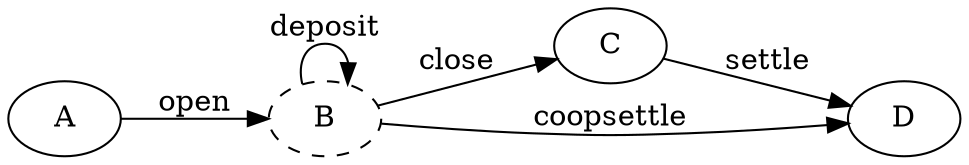

## Blockchain synchronization and transaction management

This document explains how Raiden synchronizes with the blockchain and handles
corner cases.

### Synchronization

Raiden's Smart Contracts are optimized to save gas. One of the biggest
strategies to save gas is to reduce the amount of data that has to be saved in
storage, this can be done by not saving the data but only its hash [[1]](#1).
If the data is needed by the client the smart contract publishes it through
events [[2]](#2).

These storage optimizations result in the absence of getters in the smart
contracts, the data is simply not available, because of this events must be
closely tracked by the client. Missing or applying events in the wrong order
will lead to desynchronization (e.g. missing a `close` event results in a stale
channel, handling a `settle` event before a `close` leads to a crash).

Raiden's approach to handle events is simple:

- Events are applied in the same order as they are generated [[4]](#4).
- Events are never filtered, and are queried since the deployment of each smart
  contract [[3]](#3).
- The client tracks its latest known *confirmed* block [[5]](#5). This value is
  updated *only* after all events for the given block have been processed
  [[6]](#6).
- Commiting the side effects of events has to be done transactionally when user
  APIs are available. [[7]](#7)

With the above the client can safely operate on its view of the Blockchain's
state.

### Races

A node will always be racing against the blockchain and thirdparty
transactions. The Ethereum client will learn about new blocks first, and
transactions of thirdparties are only known after they are mined.

As a consequence a transaction failure can be either a race condition or a bug,
either in the client, the smart contract, or the solidity compiler. Example: If
both participants call `settle`, the transaction mined last will fail because
the channel is already settled -- this is not a bug but a race condition. If
both transactions fail, it may be either a client, smart contract, or compiler
bug. If the transaction is sent _after_ the channel has been settled it is a
client bug.

All of the above can fail with the same require expression, e.g. the function
settle requires the channel state to be `CLOSED` when it is called. In order to
differentiate the three scenarios and provide better error messages, the
following three-step strategy is used:

1. Precondition checks: At the user interfaces (APIs and UIs) the client must
   check that a operation is valid and reject invalid calls right away. Valid
   calls are then saved with the block number at the time of the call as the
   `trigerring_block`. At the moment the transaction is sent all of the
   function's conditions are checked again against the `triggerring_block`
   (asserts and requires), it is a client bug when any of the conditions are
   not met and an exception is raised. [[8]](#8)
2. Gas estimation: If the preconditions are met, then the transaction's
   `startgas` is estimated through `eth_estimateGas` against the `latest` block
   [[9]](#9). If the gas estimation failed. A race condition is *assumed* and
   the reason for the failue is checked. This checks if the transaction is
   still valid against the **current** state of the smart contract, and not the
   state at triggering block.
3. Transaction is sent: If the gas estimation was successful, then the
   transaction is sent. The transaction may fail in two ways:
    1. With an assert: This either a smart contract (a check that should be a
       require and not an assert), compiler (a bad instruction was emitted), or
       estimate gas bug (the assert was hit but the estimation gas did not
       fail).
    2. With a revert: A race condition is assumed, and the side-effects are
       checked. If the smart contract state did not change a bug is assumed.

### Preconditions

The preconditions checks can fail on some edge cases, namely when a node goes
offline for an extended period of time. If user requested a deposit at block
`n`, goes offline and only comes back after `prune_blocks` time, the
precondition checks cannot be done.

As a consequence from the above, it's not always possible to detect client
errors on edge cases. The approach taken in the current version of the code is
to run:

```python
try:
    # First query all relevant data for the checks
    first = proxy.get_first(at=triggering_block.block_number)
    second = proxy.get_second(at=triggering_block.block_number)
    nth = proxy.get_n(at=triggering_block.block_number)
    block = self.get_block(block=triggerring_block.block_number)
except ValueError:
    # if any of the above fails, the checks cannot be performed.
    # Note that the first call may succeed, but the second can
    # still fail, because of race conditions.
    pass
else:
    assert block['blockHash'] == trigerring_block.block_hash
    # if all data is available perform the checks
    precondition_check(first, second, nth)
```

It is also importanto to note that precondition checks are only done for one
transaction at time. A precondition check by itself can not prevent nor detect
race conditions with other nodes in the network or even with the node itself.
[[12]](#12)

### Gas estimation

Gas estimation is assumed to fail under these circumstances [[10]](#10)
[[11]](#11):

- The state of the smart contract changed since the `triggering_block`, and a
  requirement is not met anymore. IOW, a race condition against the
  participants transactions.
- The smart contract or its compiler had a bug. Not all preconditions were
  covered: this is a client bug.

The first hypothesis can be checked if the state machine for the smart contract
is a DAG. The state of the smart contract will have to have moved forward on
the `latest` block (see below).



If, from the node's perspective at `trigerred_block` the state of a channel is
at `B` the function call to `deposit` is valid. If the gas estimation fail,
everything is okay if the state of the channel has moved to either `C` or `D`.

The third is it a catch-all hypothesis, by definition it cannot be detected by
the code.

#### Transaction failed

A transaction cannot fail for all reasons that gas estimations can fail. The
reasons for a failed _sent_ transaction are fewer than during the gas
estimation.  A transaction must not hit an assert (IOW, it must not consume all
the `startgas`), otherwise the assumptions about estimate gas are incorrect.

### Sample

```python
@dataclass
class ConfirmedBlock:
    block_number: BlockNumber
    block_hash: BlockHash


class Proxy:
    def smart_contract_function(self, triggerring_block: ConfirmedBlock, *args):
        # Validate values that don't depend on the on-chain state.
        # Example: settlement window ranges, signatures, order of arguments.
        self._function_validate_values(*args)
        latest_block = self.get_block(block='latest')

        # If this function depends on the side-effect of any other transaction
        confirmed_at = triggerring_block.block_number + CONFIRMATION_BLOCKS
        is_confirmed = confirmed_at >= latest_block['blockNumber']

        if not is_confirmed:
            raise ValueError(
                'Trying an operation on an unconfirmed block is not allowed'
                'because of reorgs'
            )

        # Validate values that depend on the on-chain state.
        #
        # Here the preconditions are checked. IOW the transaction was
        # valid at request time, if it fails assume a bug.
        try:
            one = self.get_1(block=triggerring_block.block_number)
            two = self.get_2(block=triggerring_block.block_number)
            block = self.get_block(block=triggerring_block.block_number)
        except BadFunctionCallOutput:
            raise Unrecoverable()
        except ValueError:
            pass
        else:
            # This would happen if CONFIRMATION_BLOCKS is too small.
            # It is very hard to recover from this case
            if not block['blockHash'] == trigerring_block.block_hash:
                raise UnrecoverableError('Confirmed block disappeared')

            self._function_preconditions(one, two)

        gas = self._function_estimate_gas(*args, block='latest')

        if gas:
            # This may raise InsufficientFunds if the account does not
            # have enough ether to pay for the gas
            receipt = self._function_send_transaction(*args)
            if receipt['status'] == RECEIPT_ERROR:
                # Check the assumption of a lost race condition.
                # If the assumption fails, assume a bug.
                self._raise_if_transaction_failed_and_used_all_gas(receipt)
                self._raise_if_transaction_failed_but_it_was_valid(block=receipt['blockNumber'])
        else:
            # Check the assumption that the smart contract state moved forward.
            # If the assumption fails, assume a bug.
            current_block = self._get_current_block()
            self._raise_if_account_didnt_have_enough_gas(block=current_block)
            self._raise_if_gas_estimation_failed_and_transaction_is_valid(block=current_block)
```

## Notes

###### 1
The SSTORE opcode costs 20_000 per word, while a SHA3 hash is 30 plus 6 per
word ([gas
ref](https://github.com/djrtwo/evm-opcode-gas-costs/blob/d76683b33b6fffb7bf7af8706d9f6f63db3af182/opcode-gas-costs_EIP-150_revision-1e18248_2017-04-12.csv)).

###### 2
The LOG? opcodes has a base cost of 375 plus 256 per word.

###### 3
This means that if a client stayed offline for a long time, startup is slow.
[#705](https://github.com/raiden-network/raiden-contracts/issues/705)

###### 4
This is done, where it makes sense. It is not necessary to apply all events
from the blockchain in order, only the ones for the same token network.

###### 5
Latest known block, because the client races with the Ethereum client and it
will drift on restarts.

###### 6
Because of this, on restarts the same event may be applied twice. This ensures
an event is never missed, but requires every event handler to be _idempotent_.

###### 7
Otherwise the user and the client view of the latest block number will race,
this leads to crashes.

###### 8
This is used both to make debugging easier and to *not* send unecessary
transactions.

###### 9
`latest` has to be used to get consistent results across ethereum clients.
Parity does not support `pending` for gas estimation.

###### 10
There is an additional edge case that currently is not handled. The estimation
may take a long while/hang.

###### 11
Estimate gas is always used, even though we do have constants for the function
calls and most of the smart contracts functions have an upper bound for gas
usage. This RPC call is not just used for the gas estimation, but mainly to
detect race conditions that may have happened after `trigerred_block`.

###### 12
This however does not prevent the node from implementing additional strategies
to avoid internally conflicting transactions.
([#6182](https://github.com/raiden-network/raiden/issues/6182)).
