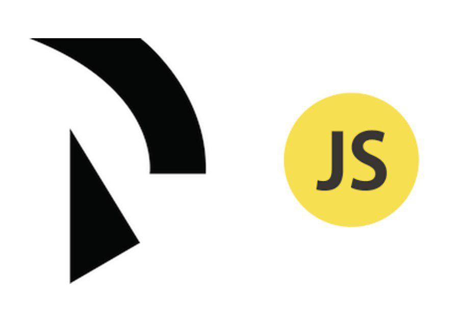

# 

Raidenjs is a library written in javascript to interact with [raiden](https://github.com/raiden-network/raiden) node

## Install

```
npm install raiden-js --save
```

## Usage

Here we are some examples

```js
const Raiden = require('raiden-js')
// You need first  to start your raiden node
let raiden = new Raiden("http://localhost:5001")
// query every registred token in the network
let tokens = raiden.token.getRegisteredTokens()
console.log(tokens);
```

> Other Examples can be seen in the sample directory of this repository

If you are new to raiden you can check [the documentation](https://raiden-network.readthedocs.io/en/stable/). if you are interested in the Raiden Project don't hesitate in asking questions in the raiden [gitter](https://gitter.im/raiden-network/raiden).

If you want to include it in html, download the browserified version in the [release page](https://github.com/Giulio2002/Raidenjs/releases).

```html
<html>
<head>
<script src="./raiden.js"></script>
</head>

<body>
	<script type = "text/javascript">
		var raiden = new Raiden("localhost:5001")
		console.log(raiden.url)
	</script>
</body>
</html>
```
## License

raidenjs is released under the [MIT License](LICENSE).

# Other Links
* [Documentation](https://github.com/Giulio2002/Raidenjs/wiki)
* [Raiden API docs](https://raiden-network.readthedocs.io/en/stable/rest_api.html)
* [Gitter](https://gitter.im/raiden-network/raiden)
* [Raiden](https://raiden.network/)


**Note: I am currenty working on an async version of all the methods covered, every method is temporary syncronous**
